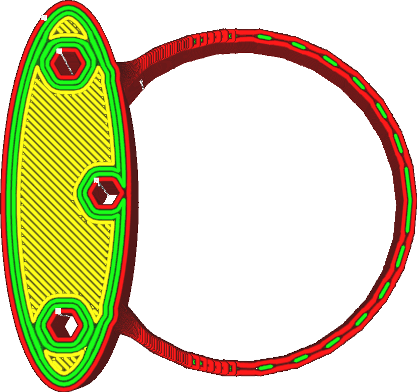

Distance du filtre de transition des parois
====
Certains modèles comportent des pièces minces qui se trouvent sur le seuil où différents nombres de cordons sont utilisés. Cela peut faire alterner le nombre de cordons d'avant en arrière, même si la largeur réelle de la pièce ne varie pas beaucoup. Cette altération nuit à la qualité de l'impression, nécessitant de nombreux changements de flux et ajoutant plus de déplacements. Grâce à cette fonctionnalité, si des transitions en avant et en arrière sont effectuées sur une certaine distance, ces transitions sont supprimées.

<!--screenshot {
"image_path": "wall_transition_filter_off.png",
"models": [{"script": "signet.scad"}],
"camera_position": [0, 11, 106],
"settings": {
	"wall_transition_filter_distance": 0,
	"wall_transition_filter_margin": 0,
	"wall_line_count": 3
},
"colours": 64
}-->
<!--screenshot {
"image_path": "wall_transition_filter_on.png",
"models": [{"script": "signet.scad"}],
"camera_position": [0, 11, 106],
"settings": {
	"wall_transition_filter_distance": 100,
	"wall_transition_filter_margin": 0.2,
	"wall_line_count": 3
},
"colours": 64
}-->

Lorsqu'une transition est supprimée, certaines lignes peuvent devenir temporairement trop larges ou trop fines, dépassant ainsi la [Largeur minimale de la ligne de paroi](min_wall_line_width.md). Après tout, il y avait une transition à cet endroit pour mieux s'adapter à la largeur de la pièce. Sans cette transition, le nombre de cordons utilisés sera inférieur ou supérieur à ce qui serait idéal, et la largeur de ces parois sera ajustée en conséquence. Ceci est autorisé jusqu'à la [marge du filtre de transition des parois](wall_transition_filter_deviation.md). Si la largeur des murs varie trop, la transition n'est pas supprimée.

Ce filtre vise à résoudre un problème courant avec les pièces minces utilisant des maillages 3D de faible résolution. Le modèle 3D, constitué de triangles plats, ne peut pas représenter une courbe de manière exacte mais seulement approximative. La courbe aura des bords, avec des surfaces plates entre eux. Lorsque vous modélisez une pièce courbe de largeur constante, il est important que les bords extérieurs soient alignés avec les bords intérieurs. Si ce n'est pas le cas, la largeur de l'anneau varie légèrement, ce qui peut provoquer l'effet illustré ci-dessus. Si c'est le cas, le filtre de transition devrait empêcher que l'effet soit trop important.

En augmentant la distance, on évite de créer de petits segments de ligne dans certains cas. Cette méthode est plus rapide à imprimer et peut donner un aspect plus lisse à la surface. Cependant, cela entraîne également une largeur de ligne extrême sur une plus grande partie de l'impression, qui risque de ne pas être bien extrudée par votre buse. Lorsque vous imprimez des modèles à faible résolution avec des pièces fines, l'augmentation de la distance peut contribuer à améliorer la qualité. Pour les matériaux difficiles, il est préférable de rester du côté de la sécurité.

**Ce paramètre n'est actuellement pas visible pour l'utilisateur. Le filtre ne peut être ajusté qu'à l'aide de la [marge du filtre de transition des parois](wall_transition_filter_deviation.md). Il affecte non seulement les parois normales, mais aussi les parois à contour supplémentaire, les parois de soutien, les parois de remplissage et les motifs concentriques**.
