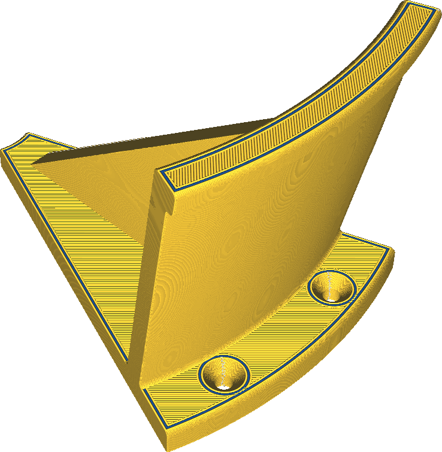

Extrudeuse de parois internes
====
Si votre imprimante possède plusieurs extrudeuses, vous pouvez choisir de n'imprimer que les parois intérieures avec une autre extrudeuse.

Il est sage d'imprimer les parois intérieures avec la même extrudeuse que le remplissage, la peau ou les parois extérieures. Il n'y a pas vraiment de raison d'imprimer les parois intérieures avec une autre extrudeuse que le reste, sauf peut-être pour un effet visuel intéressant. La couleur de la paroi intérieure a tendance à briller légèrement à travers la paroi extérieure.

L'impression des parois intérieures avec la même extrudeuse que le remplissage, la peau ou la paroi extérieure permet de mieux les fixer à ces structures. Cela crée une pièce plus solide. Lorsque vous réglez l'extrudeuse de ces autres structures, gardez à l'esprit ce à quoi vous souhaitez fixer les parois intérieures.
