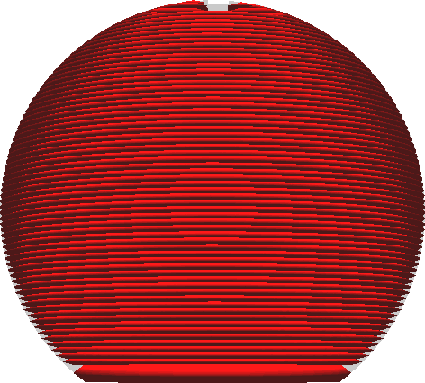
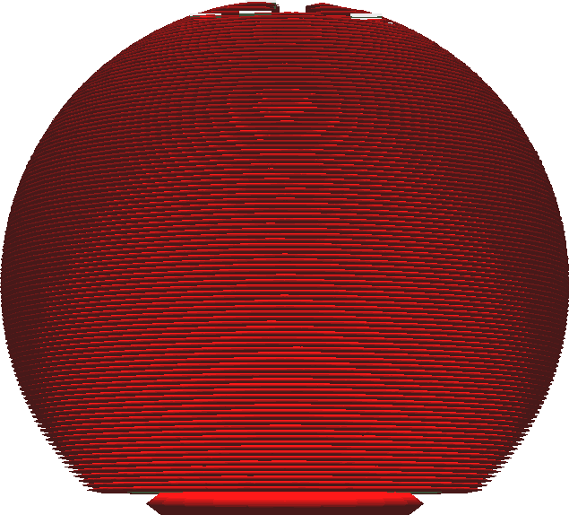

Expansion horizontale de la couche initiale
===

Ce réglage n'étend que la couche initiale qui repose sur la plaque de construction (ou sur le radeau). Comme pour [Expansion horizontale](./xy_offset.md), une valeur positive élargira la couche initiale tandis qu'une valeur négative la réduira.

La couche initiale est souvent imprimée sur un plateau chauffée, qui la maintient dans un état légèrement liquide afin d'améliorer l'adhérence au plateau de montage. La couche initiale est normalement beaucoup plus épaisse que le reste des couches. Cela laisse suffisamment de temps et de matière pour que la couche s'affaisse latéralement, créant un phénomène appelé "pied d'éléphant" où la face inférieure de l'impression a une lèvre légèrement plus large. Ce réglage peut compenser le pied d'éléphant en rendant la couche initiale plus mince à l'avance. Donnez à ce réglage une petite valeur négative pour compenser la patte de l'éléphant.

Vous pouvez également donner à ce paramètre une valeur importante pour créer un pseudo-bord autour de votre empreinte qui peut être combiné avec d'autres techniques d'adhésion telles que le radeau. Gardez à l'esprit que cela entraînera également une expansion de la peau, de sorte qu'il y aura de la peau sous les parois de la deuxième couche.

**La combinaison de ce réglage avec un bord est inefficace, car le bord produira de toute façon une large bordure autour de la couche initiale.**
