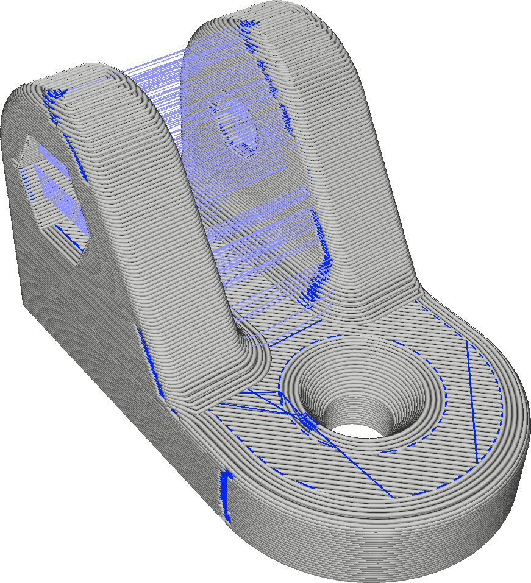
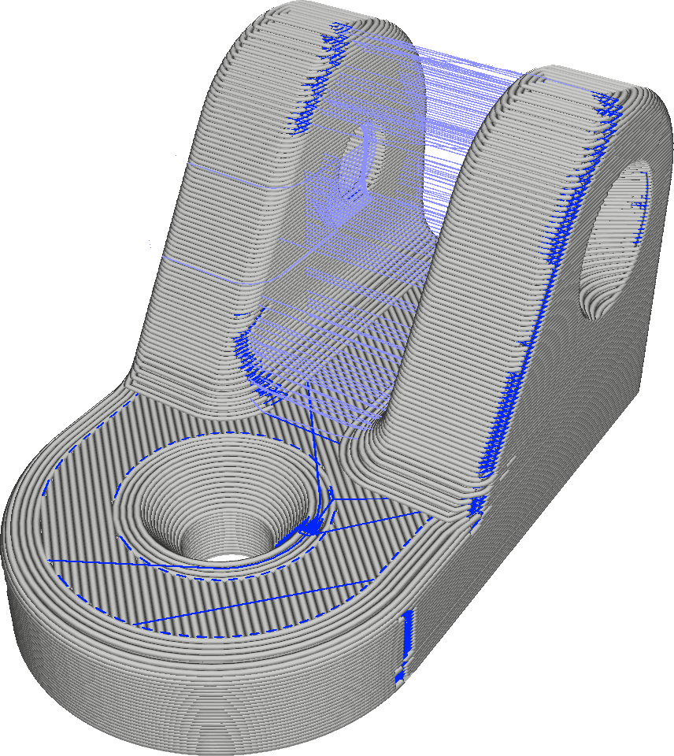

If the location of the seam is set to "User Specified" in the [Z Seam Alignment](z_seam_type.md) setting, the seam will be placed in the direction specified by this setting.

Eight ordinal directions are available for the seam's position. It is best to choose a location for the seam that is hard to see in the final object, so it depends heavily on the design of your model. Usually it is best to choose a position of the seam that is in an inside corner, but if such a corner is not available you could also choose a position that is easy to cut away with a knife after printing.

**The seam is actually placed as close as possible to the position indicated by the [Z Seam X](z_seam_x.md) and [Z Seam Y](z_seam_y.md) settings. This is a convenience setting that sets those coordinates more intuitively.**