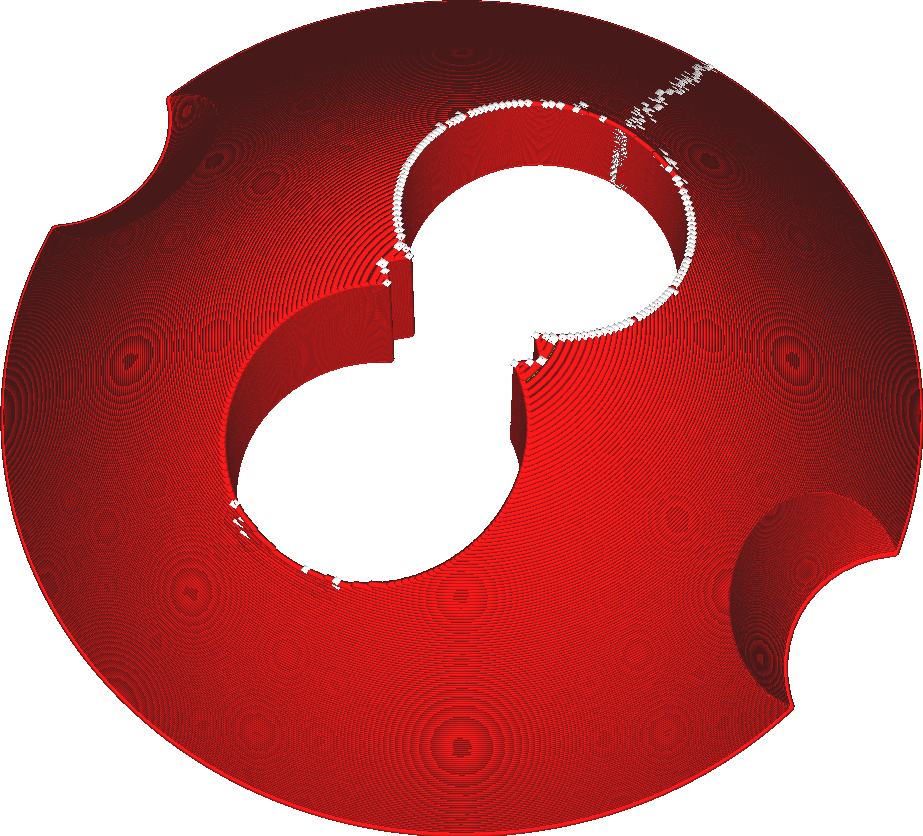

Alignement de la jointure en Z
===

Ce paramètre vous permet de choisir l'endroit où la couture de chaque contour est placée. Plusieurs options sont disponibles qui permettent de contrôler l'endroit où la couture est placée afin de minimiser son impact ou de vous permettre de la retirer plus facilement lors du post-traitement.

La couture est l'endroit où le contour commence et finit l'impression. Même si le chemin de la buse est un cercle fermé, il reste une couture à l'endroit où l'extrusion commence et se termine car le processus d'impression n'est jamais complètement précis. Avec ce réglage, la visibilité de la couture peut être minimisée en la cachant quelque part ou en la répartissant.

Utilisateur spécifié
----

Cette option vous permet de choisir un lieu manuellement. La couture sera placée dans le coin le plus proche de l'emplacement choisi. En général, les coins sont ainsi très proches les uns des autres, ce qui permet de découper facilement la couture. Cela permet également de contrôler avec précision l'endroit où la couture doit être placée.

Par défaut, un emplacement à l'arrière de l'imprimante est choisi. L'idée est que les utilisateurs laissent généralement la partie avant de leurs modèles face à l'avant de l'imprimante, de sorte qu'un emplacement à l'arrière cachera mieux la couture.

Le plus court
----

Cette option minimise simplement la longueur des déplacements vers la couture, sans faire d'effort pour la placer à un endroit particulier. Comme le trajet est plus court, vous gagnerez un peu de temps sur les déplacements. La couture sera également légèrement plus petite, car moins de suintement sera placé à l'endroit où la buse atterrit sur le contour.

La préférence de coin souhaitée est toujours maintenue en choisissant un coin proche de l'endroit où se trouve la buse. Le coin le plus proche n'est pas choisi, mais une préférence pondérée est utilisée pour minimiser quelque peu les déplacements, mais aussi pour utiliser un coin approprié pour le paramètre [Préférence de jointure d'angle](z_seam_corner.md).

Aléatoire
----

Un emplacement aléatoire autour du périmètre est choisi pour la couture. Cet emplacement aléatoire est modifié dans chaque couche, de sorte que la couture s'étale à peu près uniformément autour du modèle. Comme les coutures des différentes couches ne sont pas alignées, la couture sera à peine visible. Cependant, la surface aura l'air un peu plus sale dans l'ensemble.

Le coin le plus aigu
----

La couture sera placée dans le coin le plus aigu de tout le contour, selon la préférence de coin choisie dans le paramètre [Préférence de jointure d'angle](z_seam_corner.md). Cela peut entraîner des déplacements plus longs, mais garantit que la couture est cachée ou exposée au maximum selon la préférence définie pour les coins.

