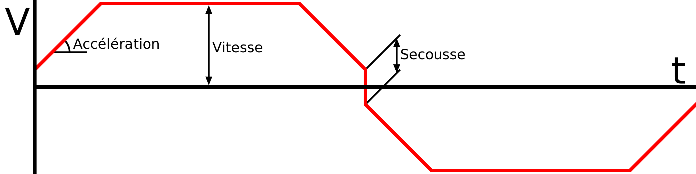

Activer le contrôle de saccade
====
la Saccade (jerk) détermine la vitesse à laquelle la buse peut passer dans les virages. Si le contrôle des saccades est activé, Cura prend le contrôle de la quantité de saccade à appliquer pendant les différentes parties de l'impression. S'il est désactivé, le microprogramme de l'imprimante choisira une valeur de saccade. Cette valeur est généralement assez élevée pour donner plus de contrôle au logiciel, mais l'imprimante peut avoir plus d'informations sur son propre matériel que Cura n'en a. 

**Le terme "jerk" a été introduit par Marlin. Il y a été conçu comme une solution de contournement du problème inhérent à la tentative de suivre parfaitement un parcours. Comme la buse ne peut pas s'écarter de la trajectoire (en théorie), il faudrait qu'elle décélère à 0 mm/s dans chaque coin. Cela ruinerait votre impression, car la décélération à 0 mm/s provoquerait une marque dans chaque coin. Il n'est pas permis de faire des courbes pour raccourcir le coin, ni de le dépasser. Au lieu de cela, Marlin permet un changement instantané du vecteur vitesse dans chaque coin. L'ampleur de ce changement du vecteur vitesse est appelée "saccade".

Ainsi, la saccade (jerk) est le changement instantané maximum de la vitesse, appliqué à chaque coin du mouvement.

Les microprogrammes qui ne sont pas basés sur Marlin, comme la famille de microprogrammes Sailfish, ignorent les changements de saccade. Ce réglage n'aura alors aucun effet.

Exemple de mathématiques de la saccade
----
Prenons par exemple une impression très simple : Déplacez-vous d'abord de 100 mm vers la droite, puis de 100 mm vers le bas. La vitesse d'impression est fixée à 50 mm/s. L'accélération est fixée à 1000mm/s^2. La vitesse de Jerk est réglée à 10mm/s. Voici ce qui va se passer :
1. Au début d'une impression, Marlin prend la moitié de la valeur de la saccade pour démarrer, donc il va théoriquement accélérer à 5mm/s instantanément.
2. A une accélération de 1000mm/s^2, il faudra 0,045s pour passer de 5mm/s à la vitesse maximale de 50mm/s. Pendant ce temps, la buse couvrira 1,2375 mm.
3. La buse se déplace pendant un certain temps à 50mm/s, la vitesse maximale d'impression.
4. Marlin calculera à quelle vitesse la buse peut passer dans le virage : La buse va faire un virage à 90 degrés, d'abord vers la droite, puis vers le bas. Pour limiter ce changement de vitesse, elle va entrer dans le coin à cos(90/2) * (10/2)mm/s en allant vers la droite, et sortir à cos(90/2) * (10/2)mm/s en descendant. Il va donc traverser le virage à environ 7,07 mm/s.
5. Il faudra 0,043s pour passer d'une vitesse de 50mm/s à 7,07mm/s.
6. Le virage se fait avec un changement de vitesse instantané. L'amplitude de la différence entre les vecteurs [7,07, 0] et [0, 7,07] est d'exactement 10 mm/s, ce qui permet de réaliser ce virage instantanément.
7. Il faudra 0,043s pour passer de 7,07mm/s à 50mm/s.
8. La buse se déplace de nouveau pendant un certain temps à 50 mm/s, la vitesse d'impression maximale.
9. Vers la fin de l'impression, la buse décélère de 50mm/s à 0mm/s en 0,05s.

