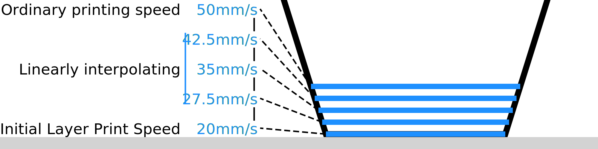

The initial layer is not the only layer that gets printed slower. This setting configures how many layers get printed slower. Over the course of these layers, the printing speed will gradually increase to the normal printing speed.

Starting from the initial layer, the speed linearly increases (or decreases) to the ordinary printing speed. This happens separately for the walls, skin, infill and so on, if they are printed at different speeds.

There are two reasons why you could want to transition to the normal printing speed over several layers. Firstly, the second and third layers are still quite close to the build plate, and moving fast over them can rip the print loose pretty easily. Secondly, the difference in flow rate between the initial layer printing speed and the ordinary printing speed may be so great that the large flow rate change may take some time to come into effect. Transitioning slowly prevents underextruding at a great speed change.

However, transitioning slowly will also make the print take longer in total.