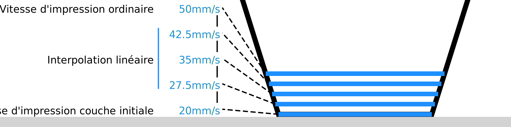

Nombre de couches plus lentes
====
La couche initiale n'est pas la seule couche qui s'imprime plus lentement. Ce paramètre permet de configurer le nombre de couches qui sont imprimées plus lentement. Au cours de ces couches, la vitesse d'impression augmentera progressivement jusqu'à la vitesse d'impression normale.

En partant de la couche initiale, la vitesse augmente (ou diminue) linéairement jusqu'à la vitesse d'impression ordinaire. Cela se produit séparément pour les parois, la peau, le remplissage, etc., s'ils sont imprimés à des vitesses différentes.

Il y a deux raisons pour lesquelles vous pourriez vouloir passer à la vitesse d'impression normale sur plusieurs couches. Tout d'abord, les deuxième et troisième couches sont encore assez proches de la plaque de construction, et le fait de passer rapidement au-dessus d'elles peut déchirer l'impression assez facilement. Deuxièmement, la différence de débit entre la vitesse d'impression de la couche initiale et la vitesse d'impression ordinaire peut être si grande que la grande variation de débit peut prendre un certain temps à se produire. La transition lente permet d'éviter la sous-extrusion lors d'un grand changement de vitesse.

Cependant, une transition lente allonge également la durée totale de l'impression.
