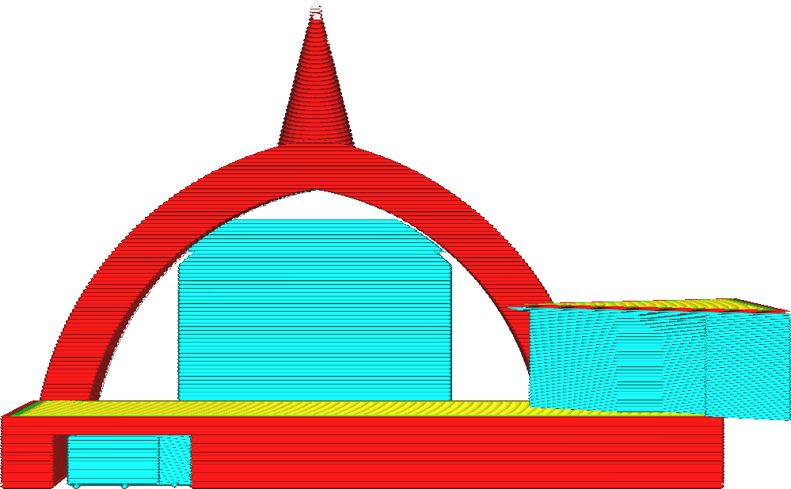

Surface minimale de support
====
Ce paramètre impose une taille minimale autorisée pour les pièces de support. Si un morceau de support a une surface inférieure à la valeur de ce paramètre sur une certaine couche, le support est laissé là.

La raison d'être de ce cadre est que de minces piliers de soutien sont susceptibles de basculer. Ils ont également tendance à soutenir de petits éléments qui s'imprimeraient probablement bien sans support. Si le support bascule, de nombreuses taches seront laissées sur l'impression. Il est donc préférable de laisser ces minces piliers de soutien en dehors. Ce réglage permet de filtrer le support par la section transversale du pilier.

En augmentant la surface, on réduit la quantité de support imprimé, ce qui réduit légèrement le temps et l'utilisation de matériel. Plus important encore, cela améliore la fiabilité de l'impression, car il y a moins de chances que les piliers de soutien ne basculent. Toutefois, cela supprime également le support des petites caractéristiques de votre impression, de sorte que la qualité du débordement peut se détériorer pour ces pièces.

Pour certaines formes, cela peut avoir le désagréable effet secondaire d'enlever la partie supérieure du support si la partie supérieure tombe sous la zone du seuil mais pas la partie inférieure. Cela peut laisser des pièces non soutenues que vous vous attendiez normalement à voir soutenues.

  
