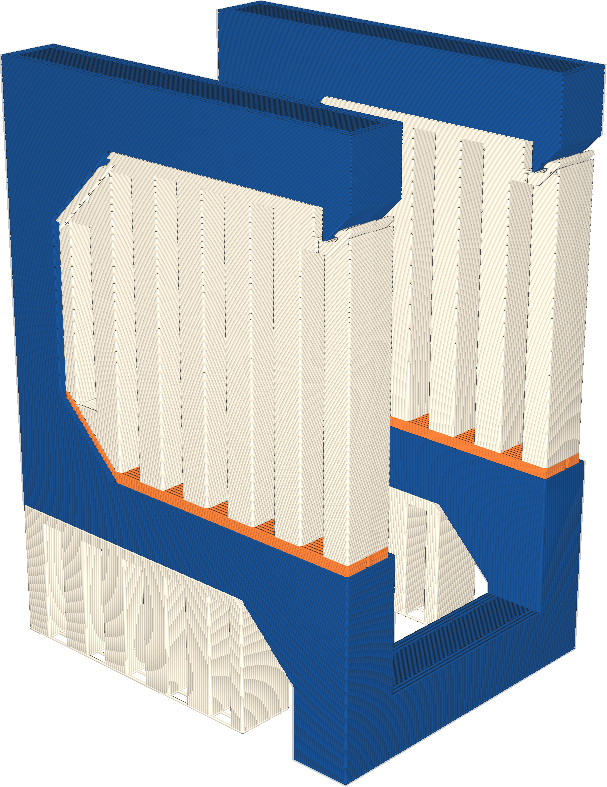

If your printer has multiple extruders, the bottom side of the support, where the support rests on the model, can be printed with a different extruder than the roof of the support, where the model rests on the support. This setting allows you to choose which extruder is used for the support floor.

Some materials provide better overhang properties than other materials when used for support. For instance they might be able to print more closely to the surface because they don't chemically bond with the surface, or they are soluble in water. However such materials are often expensive and take longer to print. This setting allows you to print the support bottom with a different extruder. This can save some of the expensive or slow-printing material.

The support floor is less important than the support roof for the quality of overhangs. If an expensive material is to be used sparingly, the support floor is a good candidate to print with the cheaper material.