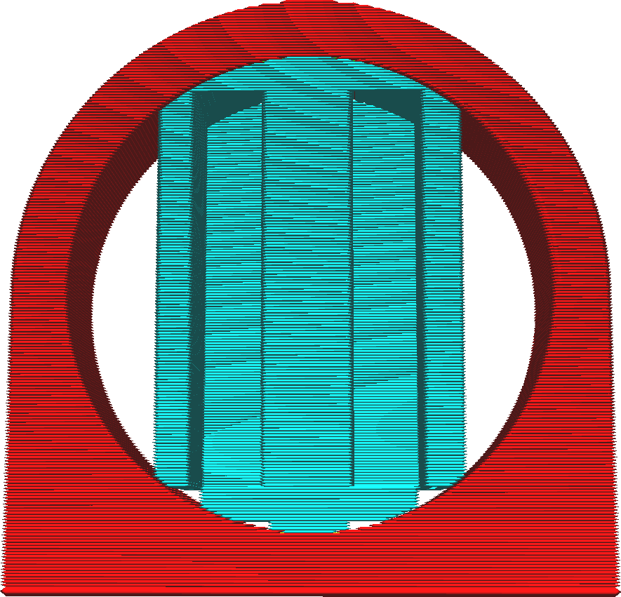

Si [Support Placement](support_type.md) est réglé sur "Partout", le support est autorisé à reposer sur le modèle. Il ne suivra cependant pas exactement les contours du modèle. Au lieu de cela, le côté inférieur du support est doté d'un modèle en escalier. De cette façon, le support n'établit un lien avec le modèle qu'à quelques endroits.

Ce réglage détermine la largeur maximale de ces marches. La marche a normalement une largeur qui suit la surface du modèle avec une valeur donnée de [Support Stair Step Height](support_bottom_stair_step_height.md). Toutefois, si elle est trop large, la largeur est limitée à la largeur maximale de la marche de l'escalier de soutien. Elle suit alors la surface du modèle pour le reste de la marche.

Ce réglage doit normalement être fixé à la distance maximale que le matériau peut franchir sans compromettre la stabilité des lignes de support au-dessus de lui. En abaissant le réglage, le support suit plus souvent le modèle, ce qui le rend plus stable. Augmenter le réglage fait que le support respecte plus souvent la valeur fixée pour la hauteur de marche de l'escalier de soutien, ce qui facilite le retrait du support du modèle.
