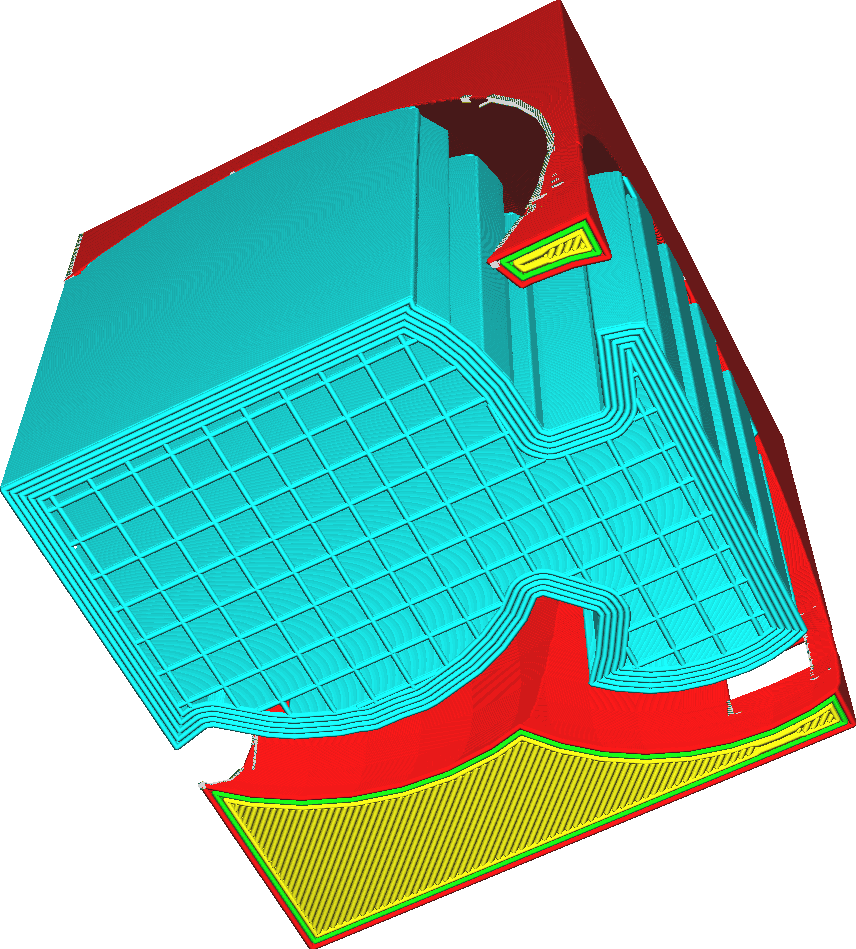
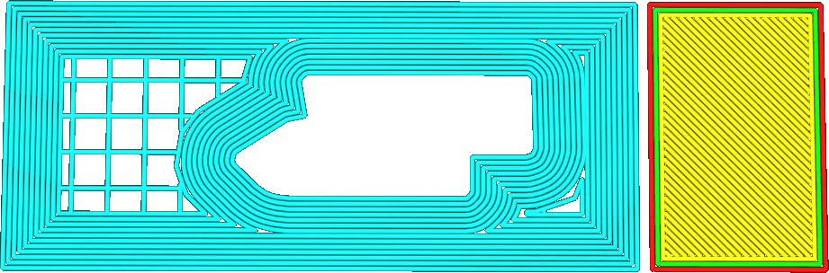

Largeur de la bordure du support
====
Ce réglage permet d'ajuster la largeur du bord du support. Avec un bord de soutien plus large, plus de contours seront dessinés à l'intérieur de la zone de soutien pour donner une meilleure adhérence.

Un bord plus large augmentera l'adhérence du support à la plaque de construction et réduira le gauchissement du support. Par conséquent, le support sera plus solide, ce qui améliorera la fiabilité de l'impression.
