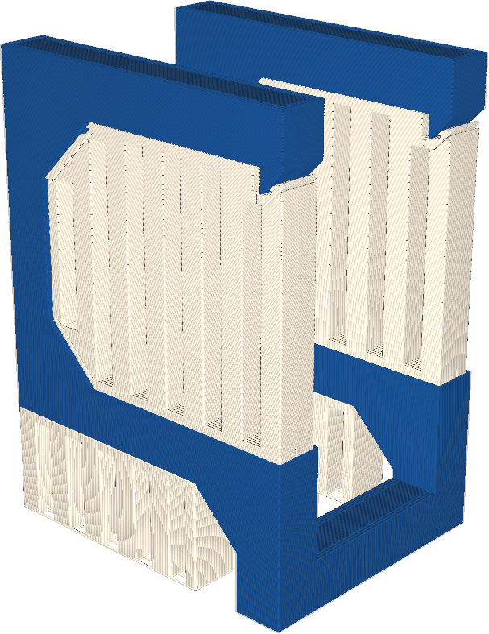

Si votre imprimante dispose de plusieurs extrudeuses, ce paramètre vous permet de choisir celle qui sera utilisée pour imprimer la structure de support.

L'utilisation d'un autre type de matériau tend à rendre le support plus facile à enlever sans compromettre la solidité du support. Les différents types de matériaux n'adhèrent pas très bien les uns aux autres, surtout s'ils ont des taux de retrait différents.

De plus, certains matériaux sont conçus pour imprimer le support. Ils peuvent être volontairement rendus extrêmement cassants, par exemple, pour qu'ils se détachent plus facilement. Certains matériaux se dissolvent dans l'eau ou dans l'éthanol, de sorte que vous pouvez retirer le support même s'il est imprimé très près du modèle.

L'impression du support avec une extrudeuse différente de celle du reste du modèle nécessite cependant que l'imprimante change de matériau à chaque couche, ce qui peut augmenter le temps d'impression. Si le matériau de support a une couleur différente de celle du matériau de construction, les résidus de support sur l'impression pourraient être très visibles.
