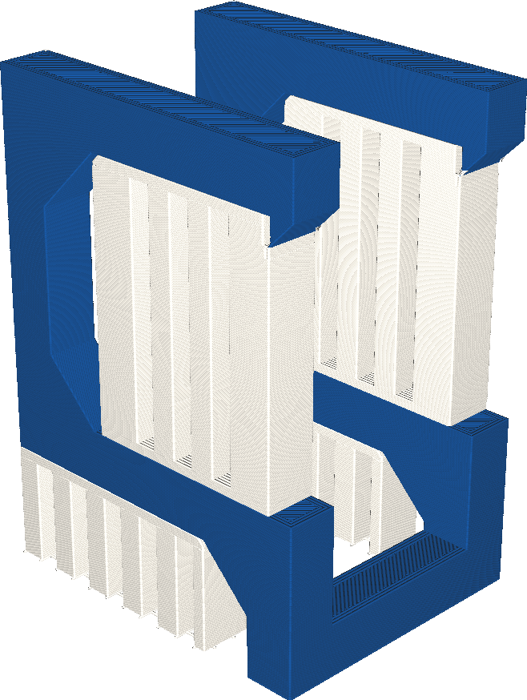

If your printer has multiple extruders, this setting allows you to choose which of these extruders is used to print the support structure with.

Using a different type of material tends to make the support easier to remove without compromising the strength of the support. Different material types don't adhere very well to each other, especially if they have different shrinkage rates.

Also, some materials are designed to print support with. They can be made extremely brittle on purpose, for instance, so that they break off more easily. Some materials dissolve in water or in ethanol, so that you can remove support even if it's printed very closely to the model.

Printing support with a different extruder than the rest of the model requires the printer to switch materials at every layer though, which could increase printing time. If the support material has a different colour than the build material, the residue of support on the print could be very visible.