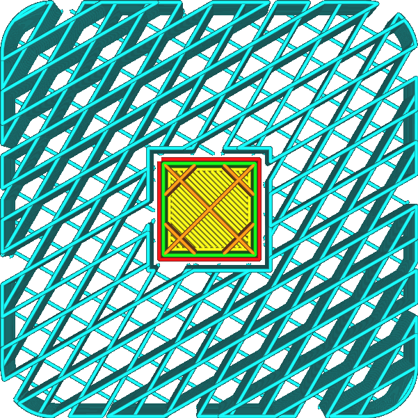

Le modèle de support est normalement orienté de telle sorte que les lignes sont perpendiculaires à la plupart des choses qu'il supporte. De cette façon, la distance que le matériau supporté doit franchir est réduite au minimum. Avec ce réglage, l'orientation des lignes de support peut être personnalisée.

Ce paramètre permet de saisir plusieurs angles, séparés par des virgules. Lorsque plusieurs angles sont saisis, Cura alternera entre ces angles sur les couches.

Si les [Top/Bottom Line Directions](skin_angles.md) ont été ajustées, il est conseillé de régler l'angle du support en conséquence, de sorte qu'il soit toujours perpendiculaire aux lignes de la face inférieure de l'impression. Cela permet à ces lignes du bas de reposer correctement sur le support, plutôt que de tomber entre les lignes du support. Ceci est particulièrement important pour les lignes et les zigzags [Support Patterns](support_pattern.md) où il y a de longues lignes droites entre les lignes de support qui n'offrent aucun support.
