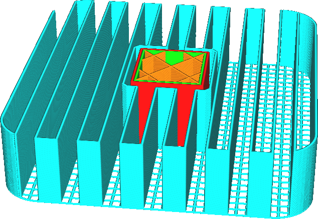

Distance d'écartement de ligne du support de la couche initiale
====
La densité du motif imprimé sur la première couche du support peut être réglée séparément de la densité du reste du support. Ce réglage permet de configurer la distance entre deux lignes adjacentes où le support repose sur la plaque de construction.

Ce réglage est utile pour améliorer l'adhérence entre le support et la plaque de construction. En rendant le motif du support plus dense dans la première couche, on augmente la surface de contact entre le support et la plaque de construction, ce qui améliore l'adhérence. Les couches suivantes peuvent ensuite être placées sur un matériau auquel elles adhèrent mieux.

Comme ce réglage n'affecte que la première couche, il n'a pas d'incidence significative sur la résistance du support, ni sur le temps et le coût des matériaux. Il n'affecte pas non plus la qualité des surplombs. Pour ajuster la densité du support à proximité des surplombs, consultez le paramètre [Distance d'écartement de ligne du plafond de support](support_roof_line_distance.md).

Il est conseillé de régler ce paramètre sur un multiple de la distance entre les lignes du corps principal du support. De cette façon, les lignes de support correspondront aux lignes de la première couche, ce qui leur permettra de reposer sur la première couche au lieu de flotter dans l'air.
