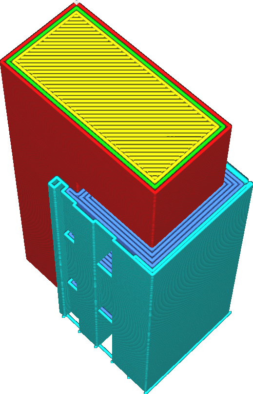

Expansion horizontale de l'interface de support
===

Ce réglage entraîne l'extension de l'interface du support dans toutes les directions horizontalement dans le reste du support.

Il existe deux cas d'utilisation de ce mécanisme.
* Si l'interface de support se termine directement au bord du surplomb qui doit être soutenu, le matériau de construction peut s'affaisser par-dessus le bord. Pour éviter cela, il faut faire en sorte que l'interface se développe un peu plus.
* Certains matériaux typiquement utilisés pour imprimer le support avec extrusion mal à faible débit ou ont besoin d'un certain temps pour se mettre en route. De petites zones de l'interface du support ne s'accordent pas bien avec ces matériaux. Ce réglage peut littéralement agrandir les zones afin qu'il y ait plus d'espace pour extruder ces matériaux.

En raison de limitations techniques, l'interface de support ne peut pas être étendue au-delà du support lui-même.
