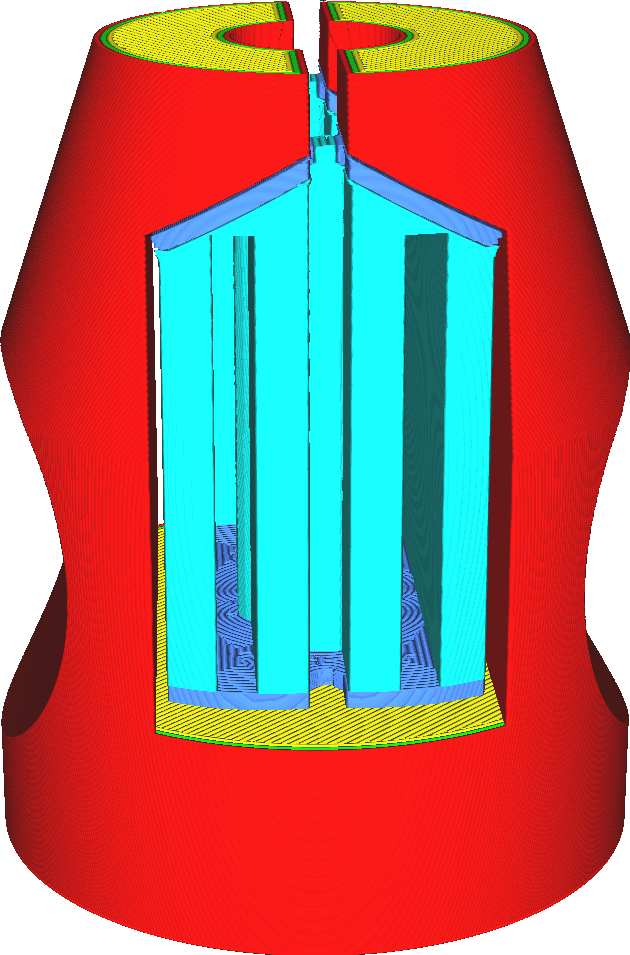
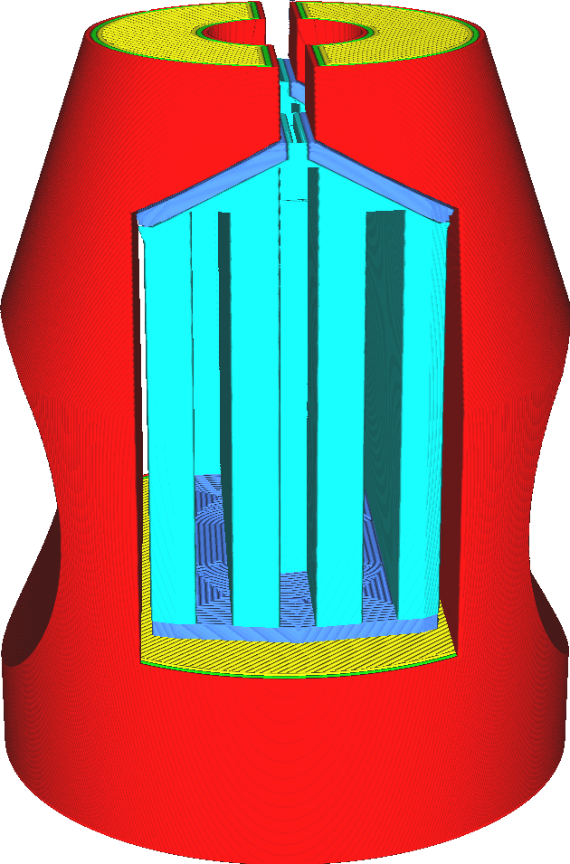

Distance de jointement des supports
====
Les supports minces ne sont généralement pas souhaitables. Ils ont tendance à basculer, ce qui peut ruiner l'impression. Lorsque plusieurs pièces de support sont adjacentes, elles peuvent être assemblées pour former une seule pièce de support beaucoup plus solide.

L'assemblage des pièces de support rend le support plus solide et plus fiable. Cela tend également à réduire le temps d'impression, en fonction du motif. De nombreux motifs nécessitent l'impression d'une paroi supplémentaire sur tout le périmètre ou une partie du périmètre, et l'assemblage de deux pièces de support réduit ce périmètre.

Si l'on augmente trop ce paramètre, on risque d'assembler des pièces de support très éloignées les unes des autres. Cela peut augmenter le temps d'impression et l'utilisation de la matière.
