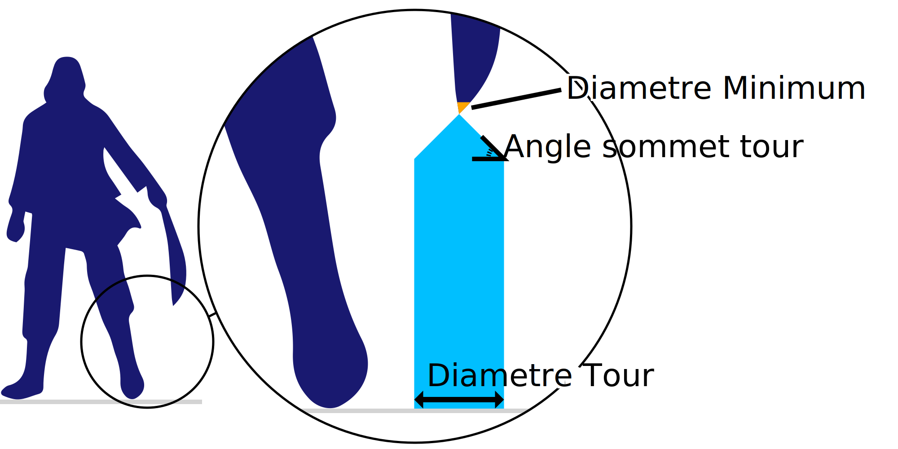

Diamètre minimal
===

Ce réglage est un seuil pour le diamètre d'un morceau de porte-à-faux permettant de choisir entre des tours de support normales et des tours de soutien. Si la pièce est plus fine que ce seuil, elle sera soutenue par une [tour de support](./support_use_towers.md). Si elle est plus large que ce seuil, elle sera soutenue par les structures de soutien ordinaires.

Si une bande de surplomb très mince a besoin d'être soutenue, le support normal se renversera. Un tel support est trop bancal pour être imprimé correctement. Au lieu de cela, une tour plus solide est générée.

En augmentant ce paramètre, les tours seront générées plus fréquemment. Cela augmente la fiabilité du support, mais nécessite aussi un peu plus de matériel et de temps d'impression.
