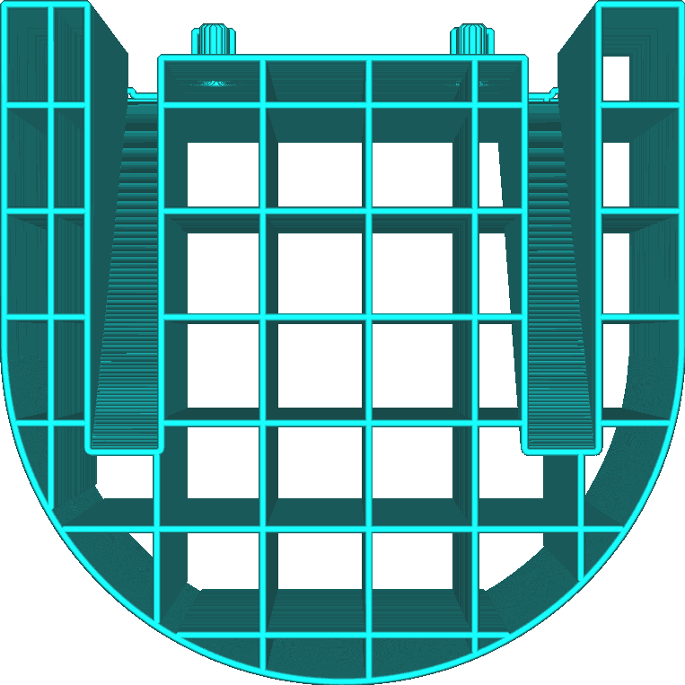
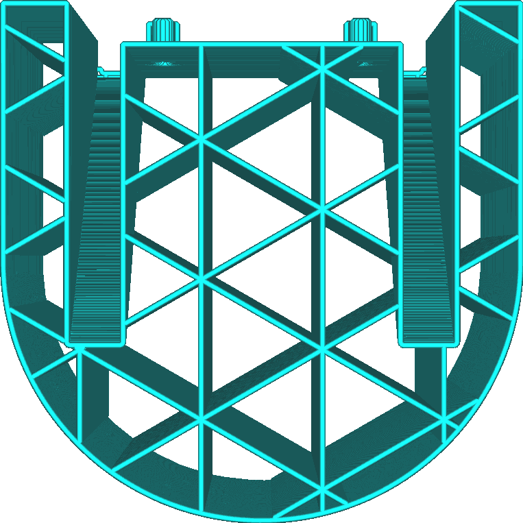

Motif du support
====
Avec ce paramètre, vous pouvez choisir le modèle qui sera utilisé pour remplir le volume de la structure de soutien. Les différents modèles ont des forces et des faiblesses différentes.

Lignes
----

Le schéma des lignes trace des lignes droites. Les lignes sont orientées de telle sorte qu'elles ne sont jamais perpendiculaires aux lignes de la peau qu'elle doit supporter (par défaut).
* Le plus facile à supprimer du modèle de tous les motifs. Ceci est très utile s'il y a une zone en surplomb qui est proche de la plaque de construction. Un couteau peut être utilisé pour couper les restes si nécessaire.
* Offre la meilleure qualité de surplomb de tous les modèles avec le zigzag. Les lignes sont très proches les unes des autres et orientées de telle sorte qu'elles ne sont pas perpendiculaires à la peau.
* Les lignes ont tendance à être instables, car elles ont tendance à basculer.

Grille
----

Le quadrillage dessine deux ensembles de lignes droites perpendiculaires entre elles. Elles se chevauchent, formant un motif de carrés. Par défaut, un périmètre est dessiné autour de ce motif.
* Très robuste, augmentant de manière fiable.
* Offre une qualité de surplomb médiocre, car les lignes sont assez éloignées les unes des autres.
* Peut être difficile à enlever, car le support ne fléchit pas beaucoup.

Triangles
----

Le motif des triangles dessine trois ensembles de lignes droites formant des angles de 60 degrés entre elles, formant un motif de triangles équilatéraux. Par défaut, un périmètre est dessiné autour de ce motif.
* Le plus solide de tous les modèles de support.
* Il offre une mauvaise qualité de surplomb, car les lignes sont très éloignées les unes des autres.
* Peut être difficile à enlever, car le support ne fléchira pas du tout dans aucune direction.

Concentrique
----

Le motif concentrique fait que le support est constitué d'anneaux concentriques régulièrement espacés de l'extérieur vers l'intérieur.
* Les lignes sont rapprochées les unes des autres, ce qui permet de bien soutenir les zones en surplomb pour obtenir une surface lisse, si les lignes sont orientées perpendiculairement.
* Assez solide, car les boucles ont individuellement une grande largeur pour se tenir debout.
* Facile à enlever, car la structure de support se plie facilement vers l'intérieur.
* Souvent, elle finit par être parallèle aux parois qu'elle doit soutenir. Cela entraîne une détérioration de la qualité du porte-à-faux, car certaines parois ne sont pas du tout soutenues.
* Parfois, le support est suspendu en l'air.

Zigzag
----

Le motif en zigzag est comme le motif en lignes, mais les lignes sont reliées aux extrémités.
* Assez robuste, ce qui augmente considérablement la fiabilité.
* Offre la meilleure qualité de surplomb de tous les modèles avec les lignes. Les lignes sont très proches les unes des autres et orientées de telle sorte qu'elles ne sont pas perpendiculaires à la peau.
* Facile à enlever. La structure de support se plie vers l'intérieur, et en tirant dessus, le support se détache en bandes.
* Il tire presque toujours le support en une seule ligne, ce qui minimise le besoin de rétractions ou de déplacements.

Croix
----

Le motif en croix dessine un motif fractionnaire dans tout le volume avec des formes en croix.
* Le plus facile à plier de tous les motifs, car il n'y a pas de longues lignes droites dans ce motif.
* Le support est presque toujours dessiné en un seul parcours, ce qui minimise le besoin de rétractions ou de déplacements.

<!--if cura_version >= 4.1-->
Gyroïde
----

Le motif gyroïde est ondulé, avec une courbe qui fait faire des va et vient à la buse. L'angle de la courbe varie d'une couche à l'autre.
* Modèle assez robuste, ce qui augmente la fiabilité.
* L'air entre le support est un volume unique. Lors de l'impression avec des matériaux de support solubles, cela permet au solvant (eau, éthanol ou autre) de dépasser à l'intérieur de la structure de support, même s'il y a un rebord en dessous. Cela lui permet de dissoudre le support plus rapidement.
* Supporte toutes les lignes du surplomb de manière égale, quelle que soit leur direction.
<!--endif-->

