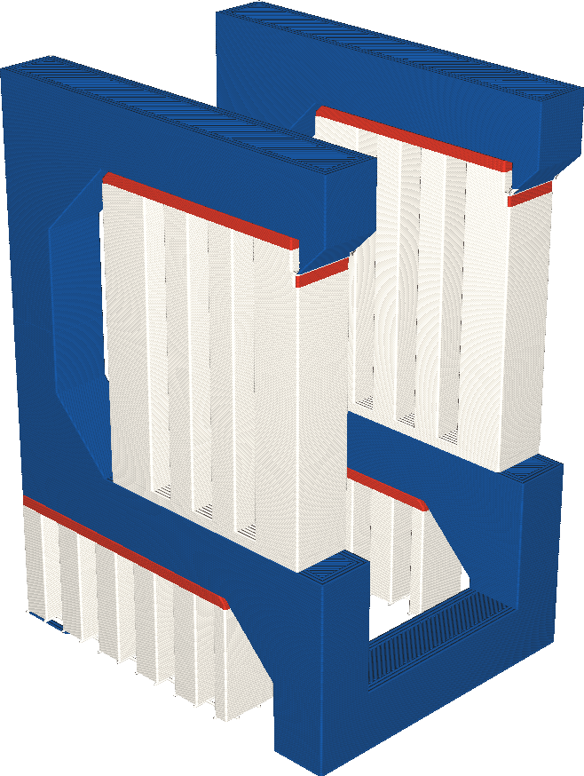

If your printer has multiple extruders, the top side of the support, where the model rests on the support, can be printed with a different extruder than the floor of the support, where the support rests on the model. This setting allows you to choose which extruder is used for the support roof.

Some materials provide better overhang properties than other materials when used for support. For instance they might be able to print more closely to the surface because they don't chemically bond with the surface, or they are soluble in water. However such materials are often expensive and take longer to print. This setting allows you to print the support roof with a different extruder than the support floor. This way, the expensive or slow material is used sparingly but it is still effective at creating good overhangs.

The support roof is more important than the support floor for the quality of overhangs, so if an expensive material is to be used sparingly, it's best to use it at least for the support roof.