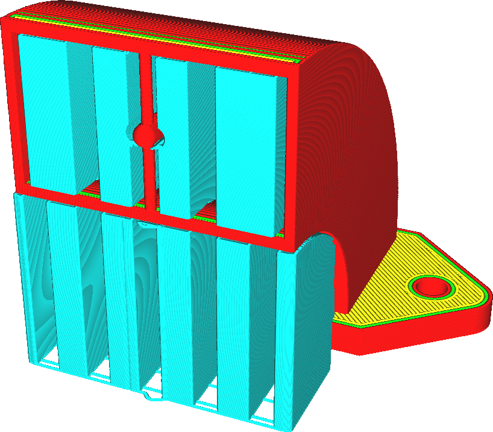
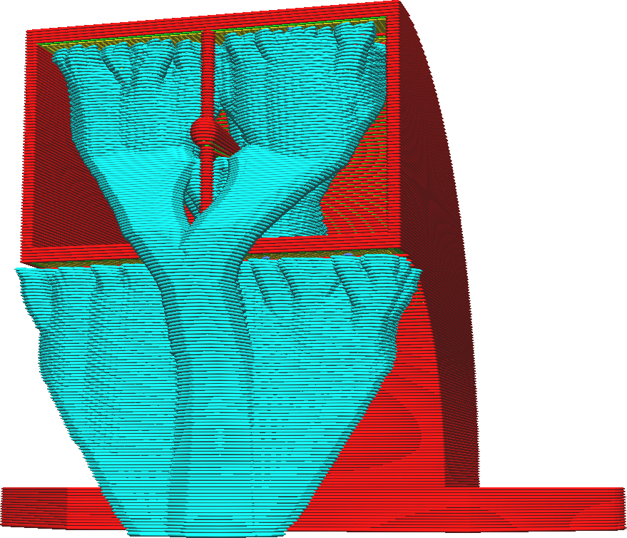

Structure du support
====
Avec ce paramètre, vous pouvez choisir l'algorithme à utiliser pour construire les structures de support. Ces constructions ont des propriétés très différentes, donc le choix d'un algorithme aura une grande influence sur la prise en charge de votre impression. Il existe deux options disponibles.

Normal
----

Il s'agit d'une structure de soutien traditionnelle, celle à laquelle la plupart des gens sont habitués. La structure est générée sous les zones en surplomb et généralement remplie d'un motif qui supporte directement les zones en surplomb. De là, il est déposé directement vers le bas jusqu'à ce qu'il atteigne le plateau de construction ou une partie du modèle qui le supporte.

La construction de support normale a été la valeur par défaut pour la plupart de l'histoire de l'impression 3D et fonctionne de la même manière dans tous les segments. C'est la norme d'or, et non sans raison:
* En raison de sa structure robuste, avec de grandes zones de contact sur le modèle et le plateau d'impression, il est très fiable. Il est très indulgent avec de mauvais réglages ou une imprimante mal réglée.
* Parce que la forme est simple, elle est rapide à trancher.
* La structure de support droite est facile à personnaliser pour un utilisateur, car il est immédiatement clair quelles bordures seront prises en charge et lesquelles ne le seront pas.

Les inconvénients les plus importants proviennent des mêmes propriétés:
* En raison des grandes zones de contact, le support est souvent difficile à retirer et peut laisser des cicatrices importantes sur la surface où il a été touché.
* Bien qu'il soit stable, il peut utiliser beaucoup de matière et prendre beaucoup de temps à imprimer. Cela peut être contrecarré dans une certaine mesure en utilisant [Rendre le porte-à-faux imprimable](../experimental/conical_overhang_enabled.md).

Comme le support sera généralement important et large, un [motif du support](support_pattern.md) est nécessaire pour supporter correctement la surface. Le motif de remplissage en zig-zag peut être utilisé pour imprimer le support en grande partie sur une seule ligne et pour permettre un retrait plus facile. D'autres modèles peuvent être combinés avec un [Nombre de lignes de la paroi du support](support_wall_count.md) pour rendre le support plus robuste à la place.

Arborescence
----

Avec le support arborescent, la structure de support commencera petit sur le plateau d'impression et créera des branches vers les parties de l'impression qui ont besoin d'être supportées.

Le support arborescent peut éviter les obstacles lors de la croissance vers les zones de surplomb, car le support n'a pas besoin de descendre directement. Dans la mesure du possible, le support reposera uniquement sur le plateau d'impression, pour éviter de cicatriser la surface sur laquelle repose le support. S'il n'y a pas de chemin entre le plateau d'impression et le surplomb, il reposera sur une surface aussi proche que possible du surplomb, afin de minimiser l'utilisation du matériau. Les branches du support arborescent sont limitées par l'[Angle des branches de support arborescent](support_tree_angle.md) afin qu'elles ne produisent pas elles-mêmes un surplomb trop important. Cela limite la capacité de se développer autour des obstacles et détermine également la hauteur à laquelle les troncs commenceront à se ramifier.

La construction du support d'arbre présente un certain nombre de grands avantages par rapport au support normal:
* Le support d'arbre utilise souvent beaucoup moins de matière que le support ordinaire. Entre 25% et 50% de l'utilisation du matériel est courante. Cela économise beaucoup de temps et réduit le coût de l'impression.
* En raison de sa petite surface de contact, le surplomb a tendance à avoir une meilleure apparence lors de l'utilisation du support arborescent.
* Aussi en raison de la petite zone de contact, le support sera plus facile à retirer.
* Il laisse moins de cicatrices sur la surface que le support normal, car il peut atteindre le modèle de le plateau d'impression vers le surplomb.

Les principaux inconvénients sont cependant:
* Le découpage prend beaucoup plus de temps que le support normal. La patience sera de mise, surtout avec les modèles hauts.
* Il y a beaucoup d'interruptions dans le flux lorsque les plus petites branches sont imprimées, ce qui rend le support arborescent impropre à l'impression avec des matériaux difficiles à extruder, tels que le PVA ou des matériaux flexibles.
* La prise en charge de l'arbre ne fonctionne pas bien pour prendre en charge certains modèles mécaniques. En particulier, il a tendance à placer trop peu de branches pour supporter des surplombs plats et inclinés.

Le support arborescent est creux par défaut. Les branches auront une petite pointe, donc un motif de remplissage ne fournit pas de support supplémentaire pour la surface en surplomb de la pièce imprimée. En raison de sa forme dentelée, le support arborescent est normalement assez robuste. Cependant, les paramètres de support ordinaires s'appliquent toujours à la zone délimitée par les branches de l'arbre. La [Densité du support](support_infill_rate.md) peut être utilisée pour donner au support plus de résistance structurelle.
