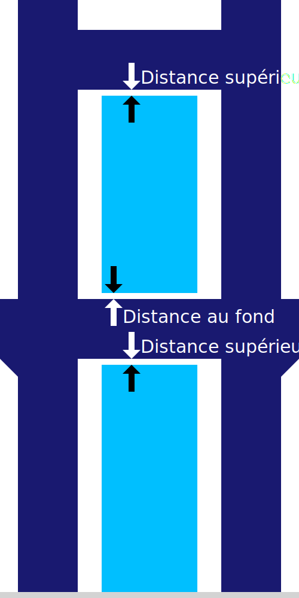

Distance supérieure des supports
===

Ce réglage permet de configurer la distance entre le sommet du support et la surface en surplomb du modèle.

La distance supérieure du support est le facteur le plus influent dans la façon dont le support adhère au modèle où le modèle repose sur le support. En augmentant la distance, il est plus facile de retirer le support après l'impression, car il n'adhérera pas bien à l'objet imprimé. Cependant, cela ne fera qu'empirer l'aspect du surplomb, puisqu'il peut s'affaisser de quelques couches supplémentaires avant de reposer sur le support.
