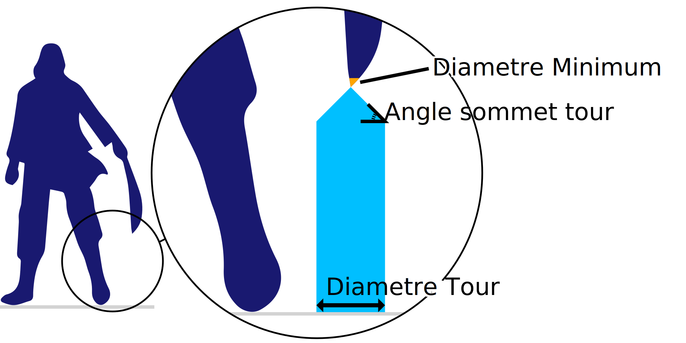

Diamètre de la tour
====
Certaines parties en surplomb de la maquette sont très petites. Le soutien qui serait généré s'effondrerait facilement. Au lieu de cela, Cura génère des tours pour ces pièces qui sont plus larges, afin qu'elles ne s'effondrent pas.

Ce réglage permet de configurer la largeur de ces tours.

Les tours plus larges prennent un peu plus de temps à imprimer et consomment plus de matériel, mais elles rendent également le support plus solide, ce qui améliore en fin de compte la fiabilité de l'impression.
