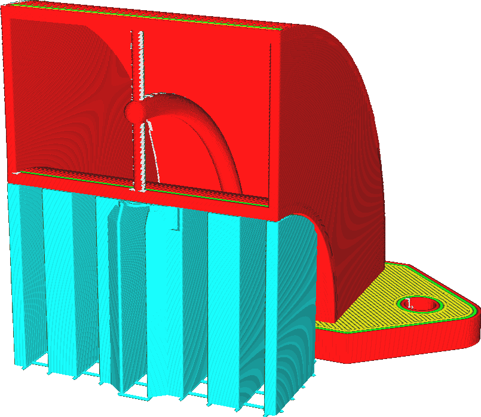

Positionnement des supports
====
Ce paramètre vous permet de choisir le support sur lequel vous souhaitez placer vos éléments supports.

Le fait de placer des aides partout est plus fiable pour le soutien. Tous les surplombs qui s'affaisseraient sont correctement soutenus. Cependant, le support peut également reposer sur le modèle, laissant une cicatrice à l'endroit où il est construit. Cela réduit la qualité visuelle et la douceur de la surface du modèle après avoir retiré le support.

Au contraire, le fait de ne placer le support que s'il touche le plateau d'impression empêche le support de reposer sur le modèle. Certaines parties de votre modèle peuvent cependant ne pas être soutenues.

*Comme astuce pour utiliser le support uniquement sur la plaque de construction, essayez [activation du support conique](../experimental/support_conical_enabled.md) et donnez une valeur négative à [Angle de support conique](../experimental/support_conical_angle.md). Cela permet au support de se développer autour du modèle tout en supportant la majeure partie du maillage sans reposer sur le modèle. Sinon, essayez le support de l'arbre.*
