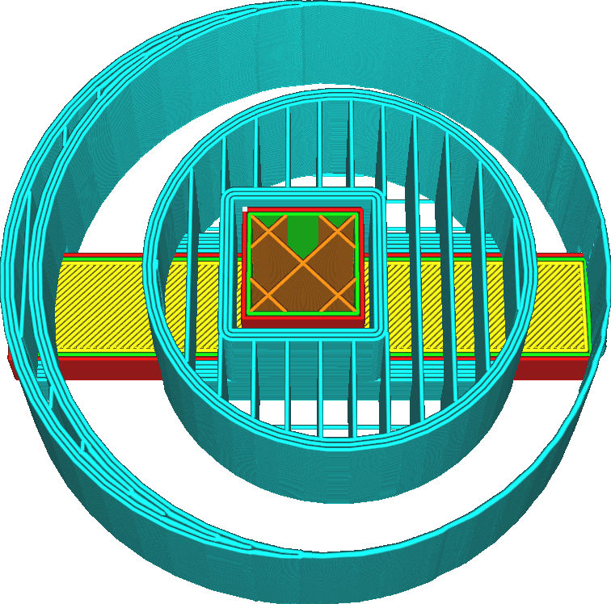

Nombre de lignes de la paroi du support
====
Ce cadre ajoute un certain nombre de parois autour du périmètre du support.

Les parois supplémentaires renforcent le support, réduisant ainsi les risques de renversement. Cela permet également au support de mieux soutenir les bords de la zone en surplomb. Pour les modèles avec des angles vifs, ces bords ont tendance à être problématiques car les lignes s'y terminent en plein air. Ce réglage peut les faire se terminer sur une ligne de support à la place.

Cependant, les parois supplémentaires prennent également plus de temps à imprimer, utilisent plus de matériau et rendent le support plus difficile à retirer de l'objet par la suite. Lorsque l'on travaille avec des matériaux de support solubles, les parois supplémentaires font que le support prend plus de temps à se dissoudre car le solvant ne peut plus pénétrer dans la structure de support par le côté.
