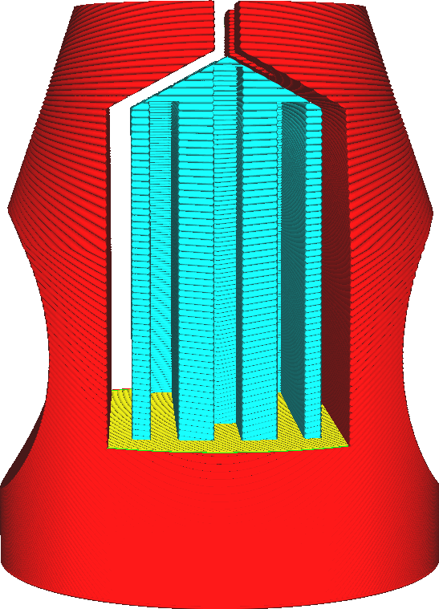

Distance X/Y des supports
===

Cela indique la distance horizontale à respecter entre le support et le modèle.

La distance horizontale a pour but d'éviter que le support ne heurte le modèle, où il laisserait une cicatrice à la surface. Cependant, cela crée également une distance plus importante entre le modèle et la structure de support à l'endroit où se trouve le porte-à-faux, ce qui laisse les petits porte-à-faux non soutenus.

Distance X/Y par rapport à Z
----
La distance X/Y et la distance Z doivent être observées exactement ; ni plus, ni moins. Comme il s'agit d'une contrainte excessive, il doit y avoir une préférence entre les deux. Cela est indiqué par le paramètre [Priorité de distance des supports](support_xy_overrides_z.md). Ce paramètre modifie le comportement de ce paramètre de distance de support X/Y.

Si X/Y a priorité sur Z, la distance X/Y est maintenue, même si cela signifie que la distance Z est trop grande. La distance Z est toujours maintenue comme minimum.

Si Z a priorité sur X/Y, la distance Z est maintenue, même si cela signifie que la distance X/Y est trop faible. La distance X/Y n'a alors d'influence qu'à partir du sommet du support où la distance Z n'a aucune influence.
