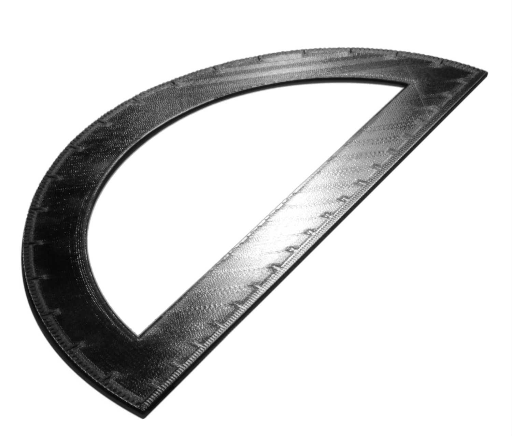
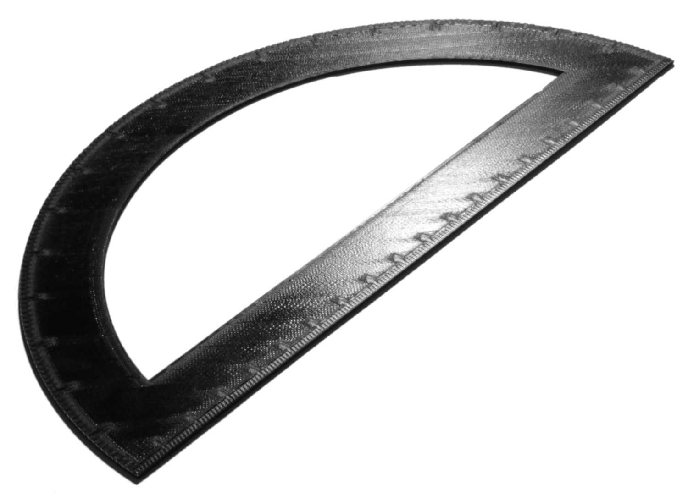

Ordre monotone dessus/dessous
====
Normalement, Cura ordonne les lignes du dessus/dessous de telle sorte que la distance de déplacement entre elles soit faible. Si ce paramètre est activé, il ordonnera les lignes du dessus/dessous de telle sorte que les lignes adjacentes soient toujours imprimées en se chevauchant dans la même direction.

Lors de l'impression des lignes du dessus/dessous, elles se chevauchent généralement un peu avec les lignes voisines, car la forme d'une ligne n'est pas un rectangle parfait. Ce chevauchement donne aux lignes une légère inclinaison, ce qui fait qu'elles réfléchissent la lumière différemment dans différentes directions. Si les lignes adjacentes se chevauchent différemment, cette réflexion change. Vous pouvez le voir dans le résultat final. Il donne à différentes zones de la surface une brillance différente. L'impression dans un ordre monotone garantit que le chevauchement est le même sur toute la surface, de sorte qu'il n'y a pas de différence dans la façon dont elle reflète la lumière. La surface paraît ainsi plus homogène et plus lisse.

L'ordre monotone augmente légèrement la longueur des déplacements, mais cet effet est très minime. Il n'a qu'un effet visuel sur l'impression. L'ordre monotone ne présente aucun avantage mécanique.

Pour obtenir une surface lisse, envisagez de combiner ce paramètre avec le paramètre [Mode de détours](../travel/retraction_combing.md) pour éviter les peaux, et peut-être d'activer la [Hauteur du décalage en Z](../travel/retraction_hop.md). Vous pouvez également activer l'[étirage](ironing_enabled.md), mais cela annule complètement l'utilité de ce paramètre. L'étirage a sa propre [option monotone](ironing_monotonic.md).

