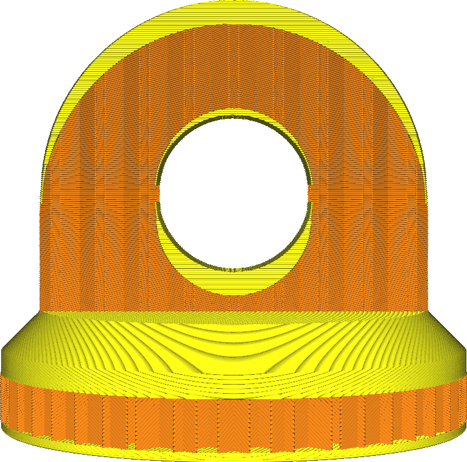

Épaisseur du dessus
====
Ce paramètre permet de configurer l'épaisseur de la face supérieure pleine de l'impression. Cette couche solide est imprimée à la place du remplissage clairsemé. Elle est destinée à fermer la face supérieure.

Une face supérieure plus épaisse aura plusieurs effets, bénéfiques pour la qualité de la surface supérieure mais préjudiciables à la productivité.
* Votre pièce sera plus solide. Une face supérieure plus épaisse signifie qu'une partie plus petite de votre impression sera remplie par le motif de remplissage épars. Au lieu de cela, elle sera rendue complètement solide.
* La surface supérieure sera plus lisse. L'effet de matelassage et les affaissements de la peau supérieure seront aplanis dans les couches supplémentaires.
* Il est plus probable que votre modèle soit étanche. Une face supérieure plus épaisse fournira plus de couches pour empêcher l'eau ou d'autres fluides de pénétrer, puisque plus de couches sont remplies complètement.
* Votre impression utilisera plus de matière, car plus de couches sont remplies complètement.
* Votre impression prendra plus de temps, car il faut placer plus de matériau et ces couches sont normalement imprimées plus lentement que le remplissage.
