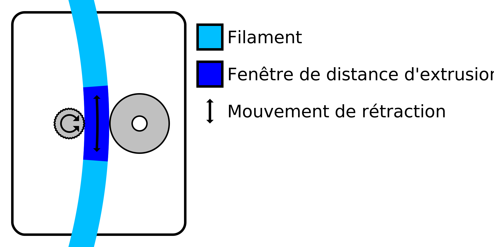

La roue d'alimentation doit s'agripper au filament pour le déplacer correctement. La rétraction de la matière a souvent tendance à user le filament au point que la roue d'alimentation ne peut plus le saisir correctement. Ce réglage limite le nombre de rétractions dans une certaine longueur de filament afin d'empêcher ce broyage.

Le réglage indique combien de fois le filament peut être rétracté pendant la longueur de filament indiquée par le réglage [Intervalle de distance minimale d'extrusion](./retraction_extrusion_window.md). Toute autre rétraction pendant cette fenêtre ne se fera pas, mais se déplacera simplement sans se rétracter.

La longueur de filament pendant laquelle le nombre de rétractions est limité est une fenêtre coulissante. Par exemple, avec une longueur de fenêtre de 3 mm et un nombre maximal de rétractions de 10, cela signifie qu'une nouvelle rétraction est autorisée dès que la 10e rétraction précédente a été effectuée à plus de 3 mm en arrière sur le filament.

La réduction du nombre maximum de rétractions réduira le meulage du filament. Ceci est utile pour les matériaux plus mous, comme le PVA. Cependant, cela augmentera également le filage, car il ne se rétractera plus dans une position où cela était apparemment souhaité.
