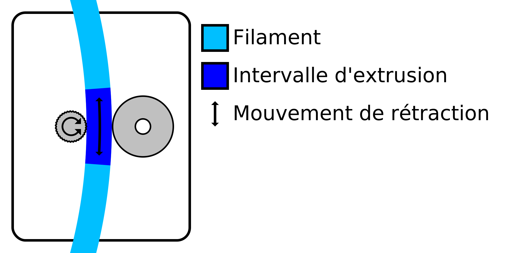

Intervalle de distance minimale d'extrusion
====
La roue d'alimentation doit s'agripper au filament pour le déplacer correctement. La rétraction de la matière a souvent tendance à user le filament au point que la roue d'alimentation ne peut plus le saisir correctement. Ce réglage limite le nombre de rétractions dans une certaine longueur de filament afin d'empêcher ce broyage.

Les rétractions sont limitées par la combinaison de [Nombre maximal de rétractions](retraction_count_max.md) et de ce réglage. Le matériau ne peut pas être rétracté plus que la valeur du nombre maximal de rétractions dans une longueur de filament indiquée par ce réglage de la fenêtre de la distance minimale d'extrusion.

La longueur de filament pendant laquelle le nombre de rétractions est limité est une fenêtre coulissante. Par exemple, avec une longueur de fenêtre de 3 mm et un nombre maximal de rétractions de 10, cela signifie qu'une nouvelle rétraction est autorisée dès que la 10e rétraction précédente a été effectuée à plus de 3 mm en arrière sur le filament.

L'augmentation de la longueur de la fenêtre d'extrusion permet de réduire efficacement le nombre de rétractions. Cela rend l'impression plus fiable, mais augmente la quantité de filaments et de taches à la surface. Ceci est particulièrement utile pour les matériaux plus mous qui sont plus sensibles au broyage.
