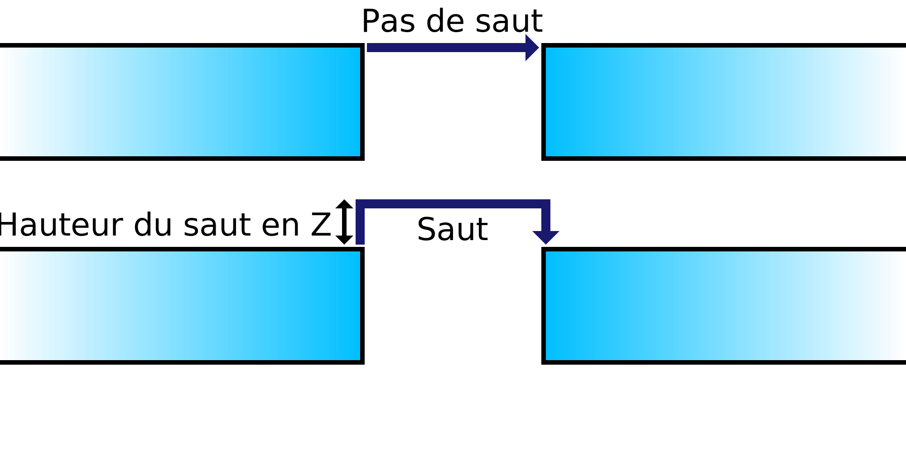

Hauteur du décalage en Z
====
Si un saut en Z est effectué, ce réglage détermine la hauteur à laquelle la buse se déplacera vers le haut avant de se rendre à destination.

Les retraits en Z plus élevés prennent plus de temps, ce qui augmente le temps total d'impression et augmente légèrement la quantité de suintement également. Cependant, le fait de passer trop bas sur la surface permet au suintement de la buse de frapper le modèle de toute façon, ce qui va à l'encontre de l'objectif du Z hop.
