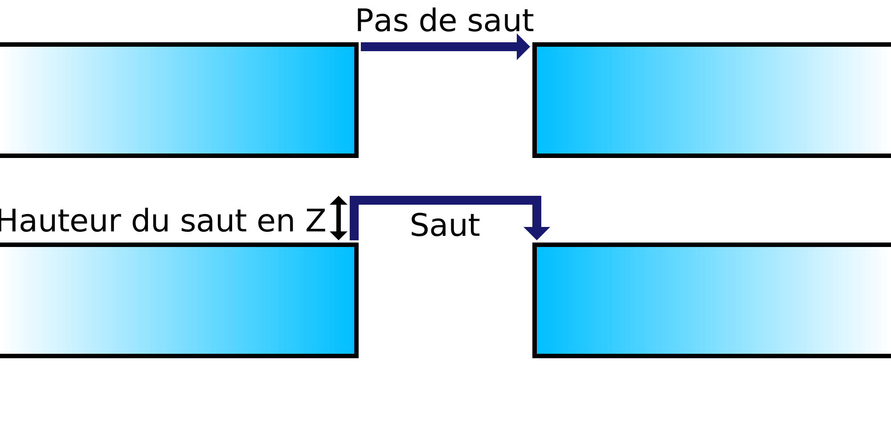

Si ce réglage est activé, la buse sera légèrement soulevée au-dessus de l'impression lorsque la buse doit se déplacer d'un endroit à l'autre. L'objectif est que la buse passe au-dessus de l'impression au lieu de frapper les parties précédemment imprimées avec la buse.

Chaque fois qu'un retrait est effectué, la buse est relevée (ou la plaque de montage abaissée) pour créer un espace entre la buse et l'impression. Cela présente plusieurs avantages :
* Il empêche la buse de heurter l'impression pendant les déplacements. Lorsque la buse frappe l'impression, elle laisse une cicatrice visible, ce qui devrait améliorer la qualité visuelle des parois de l'impression.
* Si la matière suinte de la buse pendant les déplacements, l'exsudat se dépose à l'endroit où la buse se pose après le déplacement, souvent dans le remplissage où il n'est pas visible. Cela permet de réduire les taches à la surface.
* Les taches à la surface ont une chance de faire tomber votre impression, donc activer ce paramètre peut améliorer la fiabilité.

Cependant, le déplacement de la buse de haut en bas prend un peu plus de temps, de sorte que votre impression sera plus longue à réaliser. L'axe Z de l'imprimante peut également s'user plus rapidement, selon la conception de l'imprimante.
