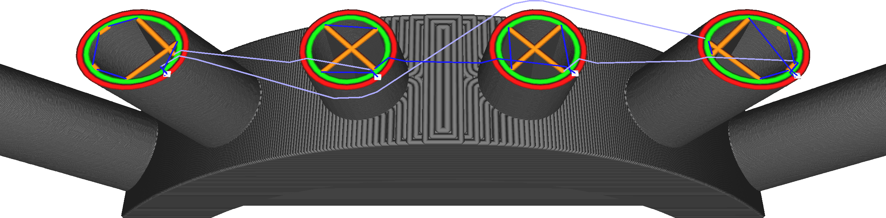

Ce réglage empêche le matériel de se rétracter pour les déplacements très courts. Pendant ces déplacements, il y a très peu de temps pour que la matière s'échappe de la buse, de sorte qu'une rétraction ferait plus de mal que de bien.

La rétraction du matériel est destinée à empêcher le filage. Les déplacements très courts ne produisent pas de filage, car le matériau n'a pas encore eu le temps de s'écouler de la buse. Les déplacements extrêmement courts d'une largeur de ligne environ seront même des lignes qui se chevauchent complètement, de sorte qu'il n'y aura pas de place pour le filage. D'autre part, en se rétractant, la buse reste immobile pendant un court instant, alors que le matériau est en mouvement. Cela permet à une partie du matériau de s'écouler et de produire une goutte à cet endroit. Pour ces raisons, il est généralement préférable de ne pas se rétracter lorsque l'on parcourt de courtes distances, même si ces traces se trouvent sur des parties visibles du modèle.

Si l'on augmente trop ce réglage, il y aura des traces dans les parties détaillées du modèle ou lorsque les pièces sont proches les unes des autres.
