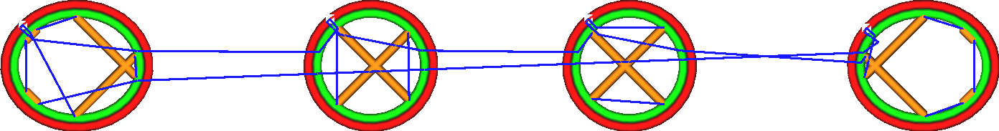
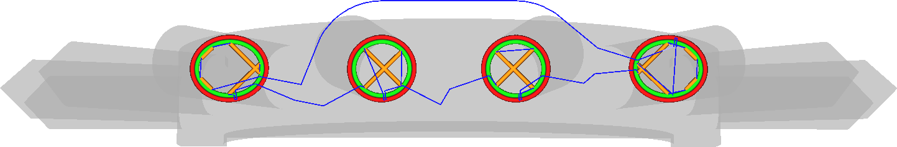

En activant ce paramètre, la tête d'impression essaiera d'éviter de heurter d'autres objets lors de ses déplacements dans le volume de construction. Elle fera plutôt un petit détour. Si un détour est possible et qu'il ne touche aucun autre objet, aucune rétraction n'est déclenchée à moins que la longueur du trajet ne dépasse le paramètre [Distance de détour maximae sans rétraction](./retraction_combing_max_distance.md).

En plus d'éviter d'autres parties, les déplacements tenteront également de rester près des murs le plus rapidement possible. Cela signifie que lorsqu'il sort ou entre dans une pièce à travers un mur, il sortira ou entrera perpendiculairement au mur.

Ce réglage tend à améliorer la qualité de la surface de l'impression, car la buse ne traversera pas les murs aussi souvent. Le passage à travers les murs laisse une cicatrice dans le mur, ce qui doit être évité.

Toutefois, ce réglage augmente le suintement, car il y aura plus de déplacements sans rétraction et les déplacements seront plus longs. Avec des matériaux qui suintent beaucoup, il peut être conseillé de désactiver le fait d'éviter d'autres parties.

Le temps d'impression peut être légèrement augmenté car les déplacements sont plus longs, mais cela est généralement compensé par la réduction du nombre de retraits que cela entraîne.
