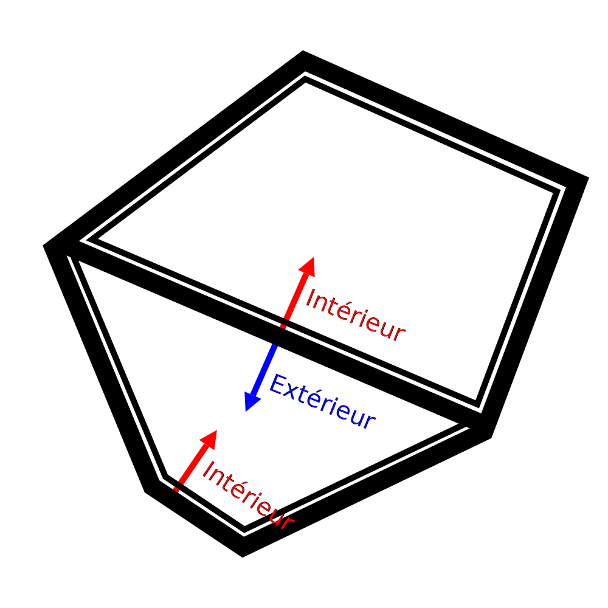

Trous dans le modèle
===

Parfois, lors de l'inspection de la vue de la couche (ou si l'on n'a pas de chance, lors de l'impression), il semble que certaines parties de l'impression manquent. Cela peut avoir plusieurs raisons. Cet article énumère quelques possibilités.

Mailles non manifold
----
Certaines mailles ont des trous dans leur surface ou une géométrie supplémentaire à l'intérieur. Cela rend Cura confus, car on ne sait plus clairement quelles parties du volume appartiennent à l'intérieur et quelles parties n'y appartiennent pas. Cura prend une section transversale de la maille à chaque couche et suppose qu'elle trouvera des boucles fermées. S'il n'y a pas de boucles fermées ou s'il y a des surfaces supplémentaires en plus de ces boucles fermées, celles-ci ne sont normalement pas imprimées. Par conséquent, s'il y a un trou dans le modèle, les sections transversales ne seront pas des boucles fermées, et les couches où ce trou existe ne seront pas imprimées. Les mailles qui contiennent de tels trous ou une géométrie supplémentaire sont appelées [non-manifold](https://en.wikipedia.org/wiki/Manifold) parce qu'elles ne pourraient pas exister dans le monde réel. 

Si la maille n'est pas multiple, vous pouvez généralement le voir en entrant dans la phase de préparation et en sélectionnant la vue aux rayons X. La vue aux rayons X colorera certaines parties en rouge si vous regardez à travers un nombre impair de surfaces, ce qui se produit lorsque la maille n'est pas multiple. De cette façon, vous pouvez identifier les problèmes de votre maillage. Vous devrez ensuite réparer ces maillages dans une application de CAO ou de modélisation.

Bien que Cura suppose normalement que le maillage est multiple, il peut réparer le modèle dans certains cas. Voici quelques exemples de ce que vous pouvez essayer :
* [Raccommodage](../meshfix/meshfix_extensive_stitching.md) gère mieux les cas où il y a une géométrie supplémentaire attachée à l'extérieur d'un modèle, bien que cela prenne un peu plus de temps à couper.
* [Conserver les faces disjointes](../meshfix/meshfix_keep_open_polygons.md) fermera toutes les boucles ouvertes avec une ligne droite. Cela permet de fermer les petits espaces. Cependant, cela peut également donner un aspect très étrange au modèle s'il comporte de grands espaces.
* En dernier recours, le [Mode Surface](../blackmagic/magic_mesh_surface_mode.md) peut être utilisé pour imprimer des parties trouées comme une simple paroi, sans aucun contenu. Comme on ne sait pas où se trouve l'intérieur de cette partie, il n'y aura pas de remplissage ou de peau, mais au moins le contour peut être dessiné. Dans certains cas, cela peut donner à l'impression que l'impression est encore passable.

Si ces options ne permettent pas d'obtenir l'impression souhaitée, vous devrez les réparer manuellement à l'aide d'applications de modélisation 3D.

Pièces fines
----
Si le modèle comporte des détails très fins, tout ne peut pas être dessiné avec les lignes épaisses qui sortent de votre imprimante 3D. Cura ajustera les lignes à l'intérieur de la forme définie par votre maillage. Si cela n'est pas possible, rien ne sera imprimé. Dans ce cas, il peut sembler qu'il manque des parties de l'impression.

Il est possible de remédier à ce problème de plusieurs façons :
* Réduire la [largeur de ligne](../resolution/line_width.md). Si vous imprimez quelque chose qui a des parois minces ou des bandes, assurez-vous que la largeur de la ligne est légèrement inférieure à la largeur minimale de cette partie. Toutefois, une réduction excessive de la largeur de ligne peut entraîner une [sous-extrusion](underextrusion.md) en raison d'un flux insuffisant. Pour pouvoir réduire davantage la largeur du trait, vous devrez utiliser une buse plus petite.
* Ajoutez un peu de [expansion horizontale](../shell/xy_offset.md) à l'impression. Cela rend le modèle entier plus large sur tous les côtés, y compris les parties fines. Elles deviennent moins fines de cette façon, de sorte qu'elles peuvent maintenant être imprimées. Bien entendu, cela ruine également la précision dimensionnelle et les détails de l'impression, car tout devient plus épais.
* Activez le paramètre [Imprimer parois fines](../shell/fill_outline_gaps.md). Ceci tentera de remplir les parties minces avec de très petites lignes sans réduire la largeur de ligne du reste du modèle. Cependant, cela provoque de grands changements dans le débit du matériau et peut ne pas toujours remplir les parois avec de belles lignes régulières.
* Pensez à adapter le modèle à l'impression, en faisant en sorte que chaque pièce soit au moins aussi épaisse que la largeur de votre ligne.
