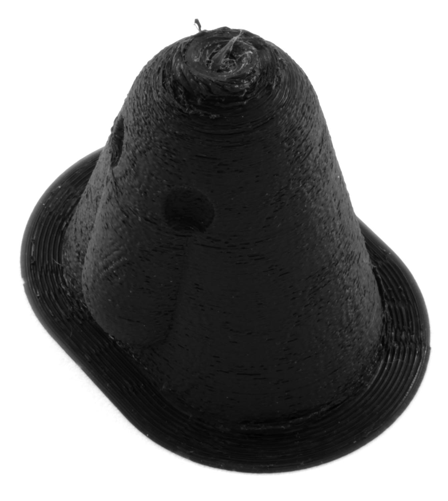

Surextrusion
====
La surextrusion est un terme utilisé lorsque l'imprimante extrude trop de matière en un seul endroit. La matière s'écoule alors sur les côtés ou vers le haut, ce qui rend la surface très rugueuse et irrégulière. Cela peut également provoquer des [Fils](stringing.md) et beaucoup de [Gouttes (blobs)](blobs.md).

Contrôle de la température
----
La cause la plus fréquente de la surextrusion est l'impression à trop haute température. Si la [température d'impression](../material/material_print_temperature.md) est réglée trop haut, la matière aura une viscosité plus faible, ce qui la fera sortir de la buse sans contrôle. Il en résulte généralement une surextrusion dans certaines zones comme les parois extérieures, mais une sous-extrusion dans d'autres comme le remplissage.

Pour y remédier, vous devez réduire progressivement votre température. Examinez attentivement la fiche technique du matériau avec lequel vous imprimez pour voir quelle est la plage de température acceptable et réduisez votre température d'impression vers la partie inférieure de cette plage.

Diamètre du filament
----
Il existe plusieurs normes pour le diamètre des filaments. Les plus courants sont 1,75 mm et 2,85 mm, mais 3,00 mm est également toujours possible. En dehors de cela, tous les fabricants ne produisent pas leur filament avec un diamètre constant. Si votre filament est plus large que ce que Cura attend, vous extruderez trop de matière, car Cura donne l'ordre à l'imprimeur d'extruder une certaine longueur de filament qui aura alors un volume trop important.

Pour remédier à ce problème, mesurez d'abord le diamètre réel du filament à l'aide d'un pied à coulisse. Il est préférable de le mesurer à plusieurs endroits, au cas où il varierait, et à différents angles autour de la circonférence. Faites la moyenne de ces mesures. Cette moyenne peut être renseignée dans Cura dans la page Gestion de la matière, en tant que propriété de la matière. Si le diamètre ne peut pas être modifié parce qu'il s'agit d'un matériau intégré, vous devrez peut-être d'abord dupliquer le matériau. Cela devrait ensuite vous permettre d'éditer le diamètre.

Calibrage de l'extrudeuse
----
Parfois, le problème réside dans le fait que la matière ne correspond pas aux attentes du microprogramme. Si le moteur de l'extrudeuse est un moteur pas à pas (ce qui est courant dans les imprimantes 3D), le microprogramme doit savoir combien de pas du moteur entraîneront le déplacement d'une certaine distance. Le microprogramme a un paramètre pour cela, mesurant la précision de l'alimentation en pas par millimètre. Si ce paramètre est mal configuré, le chargeur peut se déplacer trop rapidement ou trop lentement. Il est préférable d'ajuster ce paramètre dans le microprogramme si vous le pouvez. Cependant, si cela est impossible, le [débit](../material/material_flow.md) dans Cura peut être ajusté pour compenser. Vous devez également compenser toutes les [distances de rétraction](../travel/retraction_amount.md) et les [vitesses](../travel/retraction_speed.md).

Chevauchement des parois
----
Cura se contente normalement de dessiner les contours de l'impression avec une certaine largeur de trait. Si les parois se rapprochent à certains endroits de l'empreinte, cela entraînera un chevauchement des lignes. Ces lignes deviennent épaisses et produisent des taches car il peut y avoir jusqu'à deux fois plus de matière que nécessaire. Lorsqu'il y a beaucoup de chevauchement, la deuxième ligne ne peut pas s'extruder, et la pression à l'intérieur de la chambre de la buse augmente jusqu'à ce qu'elle soit expulsée et produise un blob.

Cela peut être évité en activant la [compensation pour les parois qui se chevauchent](../shell/travel_compensate_overlapping_walls_enabled.md). L'extrusion de la deuxième ligne sera réduite de telle sorte qu'elle extrude autant de matériau que nécessaire pour remplir l'espace restant de la paroi, ce qui empêche la surextrusion.

Si les parois se chevauchent en raison de l'[Insert de paroi externe](../shell/wall_0_inset.md), vous pouvez essayer de réduire ce décalage pour éviter la surextrusion. Vous pouvez également essayer d'imprimer la [paroi extérieur d'abord](../shell/outer_inset_first.md). L'excès de matériau sera alors poussé vers l'intérieur du modèle, où il est invisible.

Réglage direct du débit
----
Si vous ne savez pas ce qui cause cette surextrusion, vous pouvez également ajuster directement le [débit](../material/material_flow.md). Réduisez le débit jusqu'à ce que votre surface apparaisse à nouveau lisse. Cela peut compenser directement un facteur inconnu.
