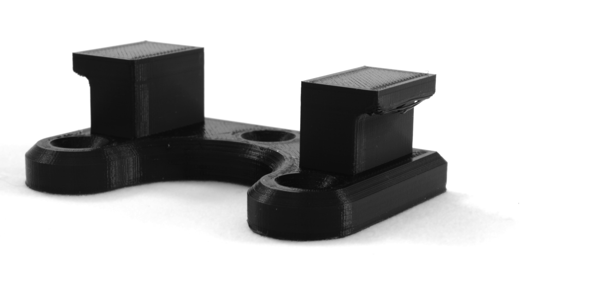
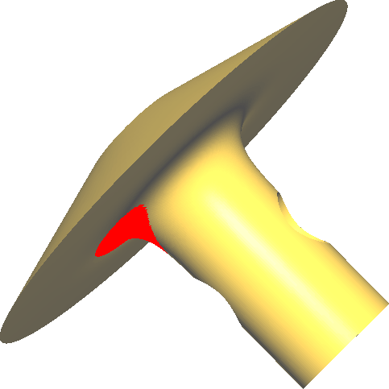

Affaissement
====
La fabrication de filaments fondus consiste à déposer une ligne de plastique fondu. Cette ligne est souple, et si elle ne repose sur rien, elle s'affaisse. C'est ce qu'on appelle l'affaissement.

L'affaissement tend à donner un aspect filandreux aux parties en surplomb. Plutôt que de suivre en douceur la surface prévue du modèle, il sera trop bas. Dans les cas extrêmes, la face inférieure d'une surface devient si déchiquetée que l'on peut voir l'intérieur creux de l'empreinte.

Causes
----
L'affaissement n'est en fait pas, ou à peine, causé par la gravité. Elle est principalement causée par la force de la matière qui est poussée hors de la buse. Ainsi, même les imprimantes qui sont retournées ou qui impriment en microgravité connaîtront ce phénomène. La pression par laquelle le matériau est extrudé pousse le matériau vers le bas car la buse est (normalement) orientée vers le bas.

Normalement, la pression à l'intérieur de la chambre de la buse est nécessaire pour pousser le matériau (visqueux) vers l'extérieur et l'aplatir sous la forme d'une ligne de matériau large et plate, en l'écrasant entre la buse et la couche précédente ou la plaque de montage. Cependant, s'il n'y avait pas de matériau dans la couche précédente, il n'y aura pas de contre-pression pour aplatir le bourrelet. Au lieu de cela, elle sera poussée trop loin vers le bas.

Pont
----
Une technique pour améliorer la qualité des surplombs consiste à optimiser la manière dont l'écart en surplomb est comblé. Cela implique de réduire la pression avec laquelle le matériau est poussé hors de la buse, ainsi que des tentatives pour augmenter la viscosité du matériau ou pour le faire se solidifier plus rapidement. En outre, les lignes imprimées peuvent être réorientées pour réduire la distance sur laquelle les lignes ne sont pas supportées. L'ensemble de ces techniques est appelé "pontage".

Cura fournit un certain nombre de moyens pour améliorer le pontage. Il en fournira encore plus si les [paramètres de pontage](../experimental/bridge_settings_enabled.md) sont activés. L'activation de cette fonction fera apparaître davantage de paramètres et ajustera également les paramètres d'impression pour les zones de pontage par défaut.

Lorsque vous configurez le pontage pour réduire l'affaissement, tenez compte des réglages suivants :
* Réduire la [température d'impression](../material/material_print_temperature.md) rend le thermoplastique plus visqueux, ce qui réduit son affaissement.
* Réduire la [hauteur de la couche](../resolution/layer_height.md) ou la [largeur de la ligne](../resolution/line_width.md) réduit la pression avec laquelle le matériau est poussé hors de la buse. Cela réduit en soi l'affaissement, mais ces lignes ont également une capacité thermique plus faible, ce qui rend les ventilateurs de la tête d'impression plus efficaces pour le refroidissement.
* La réduction de la [vitesse d'impression](../speed/speed_print.md) réduit également la pression avec laquelle le matériau est poussé hors de la buse. Dans ce cas, la capacité thermique n'est pas réduite, mais les ventilateurs soufflent sur le matériau plus longtemps, ce qui augmente également leur efficacité et réduit l'affaissement. Si les réglages des ponts sont activés, la vitesse d'impression des ponts peut être réglée séparément. La réduction de la [vitesse d'impression des murs de pont](../experimental/bridge_wall_speed.md) est efficace pour améliorer les surplombs en pente. La réduction de la [vitesse d'impression de la peau du pont](../experimental/bridge_skin_speed.md) est efficace pour réduire l'affaissement dans les zones de surplomb complètement horizontales. Il existe également une variante qui permet d'ajuster la [vitesse pour les murs en surplomb](../experimental/wall_overhang_speed_factor.md). Ce réglage est appliqué même si la surface n'est pas complètement horizontale, ce qui permet d'obtenir une vitesse d'impression spécifique pour les murs en surplomb, uniquement pour les murs en pente.
* La réduction du [débit](../material/material_flow.md) est similaire à la réduction de la largeur de ligne. Cela réduira la pression avec laquelle le matériau est expulsé ainsi que la capacité thermique, ce qui permettra au matériau de se solidifier plus rapidement. Ce paramètre peut également être ajusté uniquement pour les zones de pontage, séparément pour les [murs](../experimental/bridge_wall_material_flow.md) ou la [peau](../experimental/bridge_skin_material_flow.md). La réduction du débit sur de grandes surfaces a tendance à produire des vides à la surface et un aspect irrégulier également, de sorte que le surplomb peut encore avoir un mauvais aspect visuel si on le modifie. Cependant, la précision dimensionnelle devrait être améliorée.
* Augmentez la [vitesse du ventilateur](../cooling/cool_fan_speed.md) pour refroidir le matériau plus rapidement. Cela solidifie le matériau plus rapidement, l'empêchant de s'affaisser.
* Imprimer les parois de [l'intérieur vers l'extérieur](../shell/outer_inset_first.md). Cela permettra à la paroi extérieure de s'appuyer sur la paroi intérieure adjacente, ce qui l'empêchera de tomber. Cette méthode est particulièrement efficace avec une petite [largeur de ligne](../resolution/wall_line_width_0.md).

Soutien
----

La façon la plus courante et la plus fiable d'améliorer les parties en surplomb est de les soutenir par une structure de soutien pendant l'impression. Cette structure de soutien est ensuite retirée après la solidification du matériau. Le support d'impression est très efficace pour prévenir l'affaissement, quelle que soit la taille de la zone en surplomb, mais il nécessite plus de temps et de matériel et laisse une cicatrice à l'endroit où le support était fixé.

Cura dispose de deux techniques pour générer un support. Il existe une méthode par défaut de "support de zone", qui est générée si [le support est activé](../support/support_enable.md). Une autre méthode de support d'arbre est générée si [support d'arbre est activé](../experimental/support_tree_enable.md). La technique par défaut est généralement plus efficace pour réduire l'affaissement, mais elle donne parfois aussi un fond plus irrégulier. Le support d'arbre tend à laisser les cordes s'affaisser un peu plus mais aussi plus régulièrement.

La génération de supports de Cura décidera automatiquement où placer les supports. Dans la plupart des cas, cela fonctionne bien, mais pour certains modèles, il se peut que le support soit trop ou trop peu important. Heureusement, Cura propose également de nombreuses méthodes pour personnaliser le placement des appuis.
* Le réglage de l'[angle de surplomb](../support/support_angle.md) est la méthode la plus simple pour régler la quantité de support à placer. Vous devez régler ce paramètre de manière à ce que toutes vos zones en surplomb soient prises en charge. Ce paramètre détermine également les zones qui seront dessinées en rouge lors de la phase de préparation. La réduction de l'angle de surplomb entraînera l'impression d'un plus grand nombre de supports, ce qui réduira l'affaissement d'un plus grand nombre de parties de l'impression, mais prendra également plus de temps et de matériel et causera plus de cicatrices.
* Vous pouvez supprimer les parties en surplomb au-dessus des autres parties en réglant le paramètre [Support Placement](../support/support_type.md) sur "Toucher la plaque de montage". Si vous réglez plutôt ce paramètre sur "Partout", vous pouvez éviter les mauvais débordements.
* Assurez-vous que la [Zone de support minimale](../support/minimum_support_area.md) n'efface pas de minces morceaux de support.
* Avec l'outil de blocage du support, vous pouvez placer des cubes dans votre scène pour éviter d'y générer du support. Vous pouvez également sélectionner ces blocs et, dans l'outil Per Model Settings, dire à Cura de les "imprimer comme support". Ils seront alors imprimés comme un nouveau morceau de support. De cette façon, vous pouvez personnaliser avec soin l'endroit exact où le support est placé. Vous pouvez même charger un modèle 3D complet dans Cura avec la forme exacte de votre support, et dire à Cura de l'imprimer comme support dans l'outil Paramètres par modèle.

Même si le surplomb est soutenu par le support, il peut encore s'affaisser un peu. Pour permettre de retirer le support, une certaine [distance verticale](../support/support_z_distance.md) est maintenue entre le modèle et le support. Le modèle s'affaissera jusqu'à cette distance avant que le support ne soit efficace, donc la réduction de la distance Z réduira l'affaissement (mais rendra le support plus difficile à enlever). Certains matériaux sont conçus pour être retirés plus facilement, en ne se liant pas chimiquement au matériau de construction ou en se dissolvant. Ces matériaux peuvent se permettre de réduire la distance Z, ce qui réduit encore l'affaissement, tout en permettant de retirer le support par la suite. L'impression peut également s'affaisser entre les lignes de support, de sorte que la réduction de la [distance entre les lignes de support](../support/support_line_distance.md) réduira également l'affaissement (mais augmentera l'impression et rendra encore plus difficile le retrait du support).

Adapter le modèle
----
Si vous avez la liberté d'ajuster le modèle qui est imprimé, cela peut donner un résultat beaucoup plus propre que d'essayer de combler les surplombs ou de les soutenir. Au lieu de laisser le matériau s'affaisser dans les surplombs, concevez et orientez votre modèle de manière à ce qu'il n'y ait pas de surplombs.

L'astuce la plus élémentaire pour appliquer cela est de faire tourner le modèle. Si votre imprimante est capable d'imprimer des angles de 45 degrés sans affaissement, vous pouvez faire pivoter un modèle avec une pièce verticale et une pièce horizontale de telle sorte qu'il y ait deux inclinaisons de 45 degrés, ce qui réduit légèrement la qualité de la paroi verticale, mais empêche l'affaissement de la partie horizontale. Veillez cependant à ne pas rendre la zone de contact avec la plaque de construction trop petite, sinon l'impression pourrait se détacher de la plaque de construction et être encore endommagée.

L'ajout de chanfreins peut également contribuer à réduire les débordements du modèle avec relativement peu de matériau ajouté. Cura propose une méthode automatisée pour ajouter des chanfreins à votre modèle, grâce au paramètre [Rendre le porte-à-faux imprimable
](../experimental/conical_overhang_enabled.md). L'ajout de chanfreins ajoute essentiellement la structure de support au modèle réel. Ils seront ensuite imprimés de façon transparente dans le modèle, qui est plus beau. Cela permet également d'économiser de la matière, par rapport à l'impression du support, puisque le matériau de support amène rapidement les forces vers le reste du modèle. Et au final, votre objet sera plus solide.

En général, lors de la conception d'objets pour l'impression 3D, il est préférable d'éviter tout débordement. Si la géométrie de l'objet ne vous le permet pas, envisagez de diviser le modèle en plusieurs parties et de les assembler ensuite.
