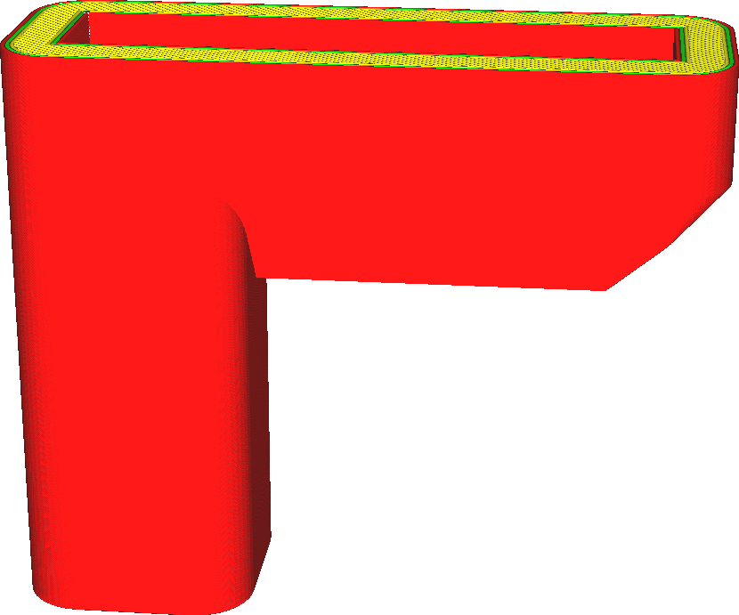

Mold Angle
====
Similar to the [Make Overhang Printable](../experimental/conical_overhang_enabled.md) feature, this setting modifies the shape of moulds such that it can be printed without support. Only the outside shape of the mould is modified, so the shape of your cast will not be affected.

<!--screenshot {
"image_path": "mold_angle.png",
"models": [
    {
        "script": "star_podium.scad",
        "transformation": ["mirrorZ"]
    }
],
"camera_position": [81, 129, 45],
"settings": {
    "mold_enabled": "True"
},
"colours": 48
}-->

Reducing this angle will reduce the extremity of overhangs. This will make the print more reliable. However it will also make the base of the print wider, which considerably increases the duration of the print and increases the amount of material it'll use.

For some shapes, modifying the outside shape of the mould is not enough to make it print properly. It'll still need support. You can achieve a similar effect by enabling [Conical Support](../experimental/support_conical_enabled.md).

<!--screenshot {
"image_path": "mold_needs_support.png",
"models": [{"script": "basic_overhang.scad"}],
"camera_position": [20, 183, 97],
"settings": {
    "mold_enabled": "True"
},
"colours": 32
}-->
