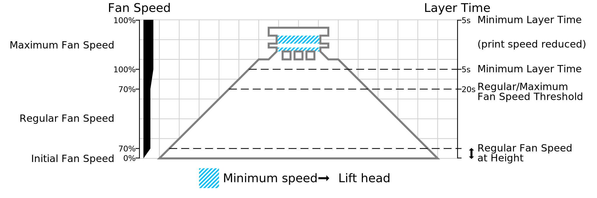

Lift Head
====
When the [Minimum Layer Time](cool_min_layer_time.md) is reached, the print head will slow down in order to prevent printing faster than the Minimum Layer Time. This way the previous layer gets time to cool down and solidify before the next layer is put on top. The print head is allowed to slow down until the [Minimum Speed](cool_min_speed.md) is reached.

If this setting is enabled and the print head should move slower than the Minimum Speed in order to maintain the Minimum Layer Time, then the print head will move up slightly after printing the layer. It will then wait for a while until the Minimum Layer Time is reached, before starting with the next layer.

If this setting is disabled, then the printer will immediately continue with the next layer. It will not wait for the Minimum Layer Time, so layers will be printed on top of layers that perhaps haven't solidified completely yet.

The print head will always move up by 3mm. There is no setting to configure this at the moment.

Trade-offs
----
There is a trade-off when slowing down the nozzle to allow the layer to cool down better. The Minimum Layer Time is intended to give some time for the material to cool down by slowing down the movement of the print head. During this time, the fans will be blowing at maximum power to cool it down more quickly, but the hot nozzle is also still on the plastic. For very small pieces, the hot nozzle may transfer more heat into the print than what the fans can blow off. This causes the plastic to melt even more than if you were to have no minimum layer time.

With Lift Head, this trade-off is resolved. You can still slow down to a point, but for very small layers it will move the hot nozzle away, so that it doesn't transfer heat into the print any more. The head is kept close by enough that any fans on the print head will still blow on the print.

The disadvantage of this is that it will effectively do a [Z hop](../travel/retraction_hop.md), which brings about some [stringing](../troubleshooting/stringing.md). While lifting the head may improve the sagging and blobbiness, it will cause a different type of mess. A bit of manual post-processing with a knife can clean up the strings it causes.