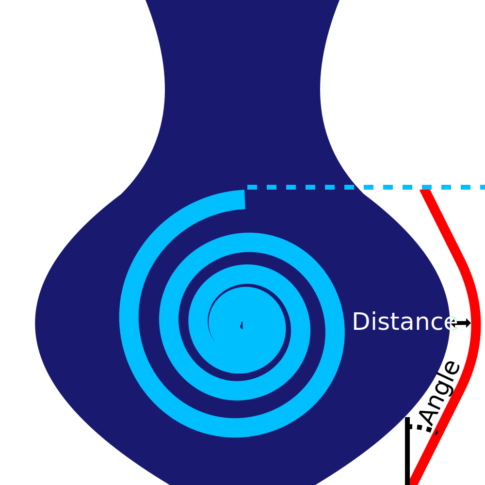

Ooze Shield Angle
====
The ooze shield will follow the shape of the model. It needs to stay close, otherwise the travel from the shield to the model will ooze new material. But the model may have horizontal surfaces, so that would create steep overhangs in the ooze shield. This setting limits the steepness of the ooze shield so that it doesn't collapse.

* A value of 0 makes the ooze shield completely vertical around the entire shape. The lower the angle, the more stable the shield will be.
* A value of 90 makes the ooze shield follow the model exactly. The higher the angle, the better the ooze shield will prevent oozing on the model.

While it would in theory make sense to use a similar value here as for the [Support Overhang Angle](../support/support_angle.md), the ooze shield is just a single line. This single line is weaker than your model and more subject to warping. It's good to use a slightly more shallow angle than what would normally print well in your model, to prevent the ooze shield from splitting.