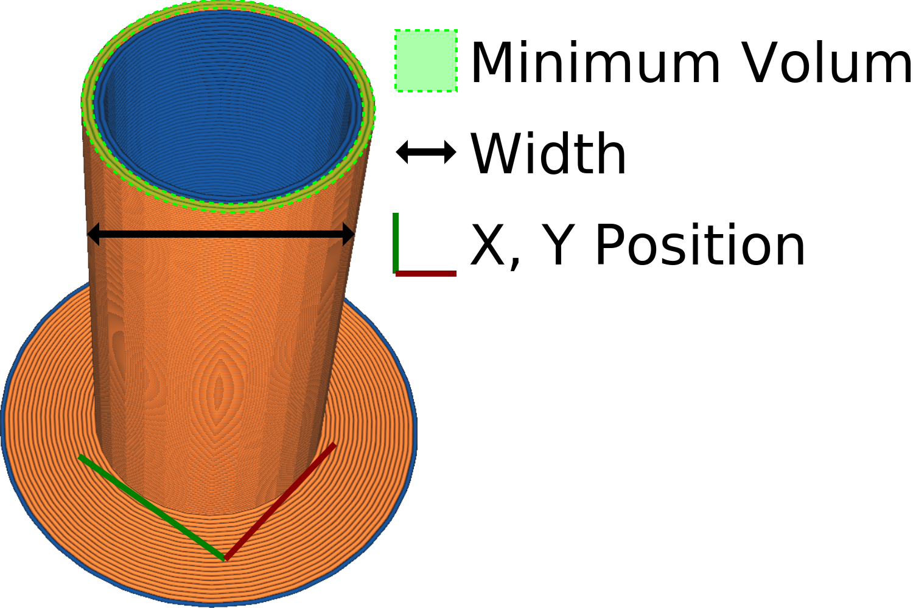

Prime Tower Minimum Volume
====
This indicates how much material must be purged every time the extruder switches. The idea is that a certain volume will have oozed out of the nozzle while it was on stand-by. The volume being primed as indicated by this setting is meant to compensate for that.

This setting indicates the minimum amount of material that needs to be purged. The contours of the prime tower will be finished completely though, so more material may be purged depending on how well the volume aligns with the volume of a contour.

Some printers have multiple separate nozzles, while others feed multiple materials into a single nozzle. A good value for this setting is very different between the two.
* If your printer has multiple nozzles, the only necessity for the primed volume is to recuperate for the material lost while the other nozzle was active. It will have oozed a bit of material, and the pressure in the nozzle chamber will have been lost. A small amount of material is enough to get the nozzle chamber back up to pressure. More runny materials, like PETG, typically need a greater volume of priming. If the Prime Tower Minimum Volume is too low, you'll get [underextrusion](../troubleshooting/underextrusion.md) at the start of the extrusion path after the extruder switch.
* If your printer pushes multiple filaments into the same nozzle, the prime tower also needs to purge the remaining material out of the nozzle. When retracting the previous filament, a small blob will always remain in the nozzle because the material there was liquid below the heat zone and doesn't get pulled along with the rest of the filament. The minimum prime tower volume therefore needs to be at least the volume of the entire hot zone of the nozzle. In practice, it needs significantly more than that, because as the new filament gets pushed in, it mixes with the old filament and squishes the old filament aside. It takes a lot more material as buffer to get all of the old material out, to prevent contamination. All of this is significantly more than the concern of recuperating the nozzle pressure due to oozing, so the oozing is not a concern any more then. If the Prime Tower Minimum Volume is too low, the materials will mix in this case, so the colours will bleed more, or you'll have dimples in your print after dissolving the water-soluble support material.

Setting the Prime Tower Minimum Volume too high is relatively harmless, but makes the print take longer and waste more material. The volume will be limited by the [Prime Tower Size](prime_tower_size.md). The volume can be set higher than the total volume of the prime tower on that layer, but if the prime tower is planned full, it will not have any effect on the print any more.

The volume may be different for each extruder, so the final tower may have different number of contours for each of the extruders.