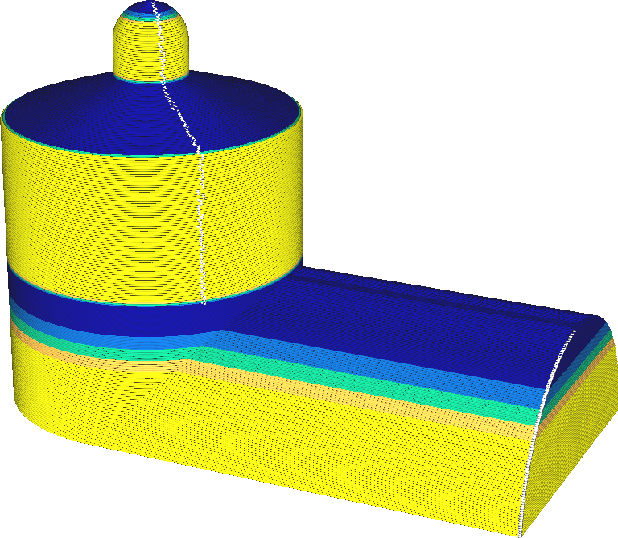
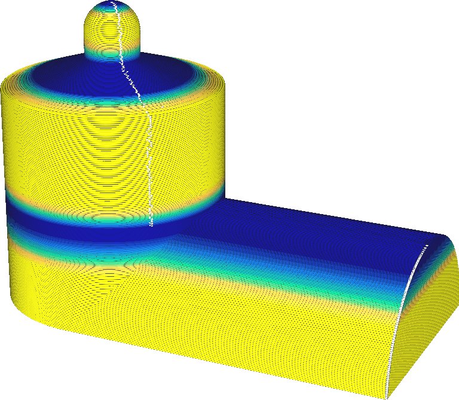

Adaptive Layers Variation Step Size
====
If the desired layer thickness of one layer is very different from an adjacent layer, there will be a large difference in the flow rate out the nozzle which can cause overextrusion or underextrusion. This setting makes sure that the difference in layer thickness is a gradual change, to prevent that. With this setting you can specify the maximum change in layer thickness between two adjacent layers.

<!--screenshot {
"image_path": "adaptive_layer_height_variation_step_0_05.png",
"models": [{"script": "barn.scad"}],
"camera_position": [-108, -229, 118],
"settings": {
    "adaptive_layer_height_enabled": true,
    "adaptive_layer_height_variation_step": 0.05,
    "layer_height": 0.2
},
"colour_scheme": "layer_thickness",
"colours": 128
}-->
<!--screenshot {
"image_path": "adaptive_layer_height_enabled.png",
"models": [{"script": "barn.scad"}],
"camera_position": [-108, -229, 118],
"settings": {
    "adaptive_layer_height_enabled": true,
    "layer_height": 0.2
},
"colour_scheme": "layer_thickness",
"colours": 128
}-->

Reducing this setting will force the layer thickness to transition more gradually. This has a number of effects on the print:
* There will be less overextrusion when transitioning to a lower layer thickness, because the flow out the nozzle has some time to adjust to a lower flow rate. This prevents blobs on the surface.
* Similarly, there will be less underextrusion when transitioning to a greater layer thickness, because the flow out the nozzle can adjust gradually to a greater flow rate.
* Banding will be less visible. Even though areas with different layer thickness will still have a different texture and colour, these areas are now farther apart which makes it more difficult to see.
* Where there is a sharp angle in the model that should cause a sudden transition to thinner layers, the topography effect will reappear. This is because the layer thickness will not be allowed to be adjusted that fast, and so thicker layers must be used for shallow surfaces.
* Similarly, where there is a sharp angle in the model that should cause a sudden transition to thicker layers, the printer will create unnecessarily thin layers, wasting printing time where it's not necessary.

Due to the implementation of the Adaptive Layers algorithm, the gradual transition to a different layer thickness will always occur *above* the angle in the model that causes the transition.