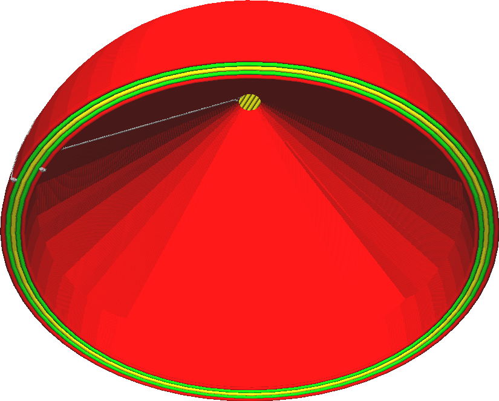

Maximum Overhang Hole Area
====
Because [Make Overhang Printable](conical_overhang_enabled.md) removes any kind of overhang, any bridges will automatically be lowered, closing up the overhang beneath it. However if the overhang is enclosed on all sides, it will keep getting lowered until the enclosed overhang is completely filled up. Effectively, any downward facing holes will get filled up completely, even if the overhang that needs to be removed is only a tiny spot at the very top.

To prevent this effect, this setting allows overhang to remain open if it is enclosed on all sides and smaller than a certain area. This only applies to holes. Regular overhang on the outside of the model is still extended downwards to retain a reasonably printable angle.

<!--screenshot {
"image_path": "conical_overhang_hole_size.png",
"models": [{"script": "plopper.scad"}],
"camera_position": [-86, 29, -85],
"settings": {
    "conical_overhang_enabled": true,
    "conical_overhang_hole_size": 20
},
"colours": 64
}-->

It is quite safe to set this setting to several dozen square millimetres for most models. If it is set too low, the model will get modified more, to support overhangs that are really too small to need any support. If it is set too high however, there will be significant overhang areas that could be difficult to bridge.

If there are big areas of overhang due to this setting, it is a good idea to first look into [tuning the bridging](bridge_settings_enabled.md) before trying to modify the model to remove the overhang.