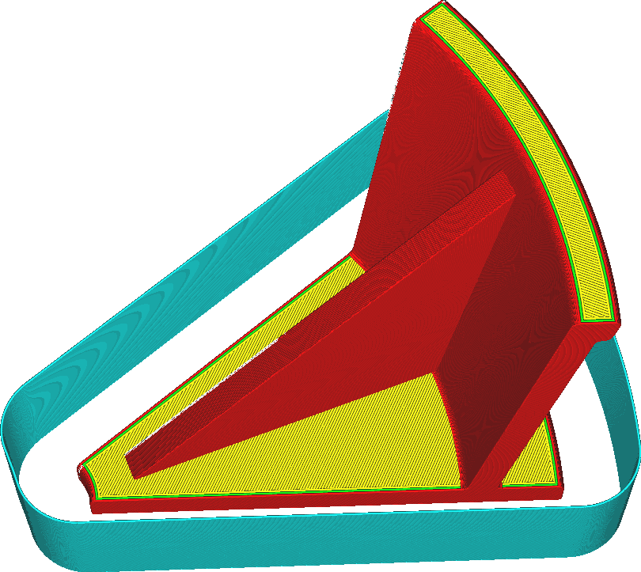

Draft Shield Height
====
If the [Draft Shield Limitation](draft_shield_height_limitation.md) setting is set to "Limited", this setting allows you to specify to what height the draft shield should be limited.

<!--screenshot {
"image_path": "draft_shield_height_limitation.png",
"models": [{"script": "headphone_hook.scad"}],
"camera_position": [-56, 139, 305],
"settings": {
    "draft_shield_enabled": true,
    "draft_shield_height_limitation": "limited",
    "draft_shield_height": 20
},
"colours": 32
}-->

The bottom side of the print tends to be most sensitive to temperature fluctuations. This is where most of the warping occurs if the room is cold, and this warping can cause the print to let go of the build plate. With this setting, you can choose what height to limit the print. Lowering the height of the draft shield can save some time and material. The draft shield will then still be protecting the bottom side of the print and will also block convection of air due to the rising of hot air (to an extent).

The draft shield can never be printed taller than the object itself.