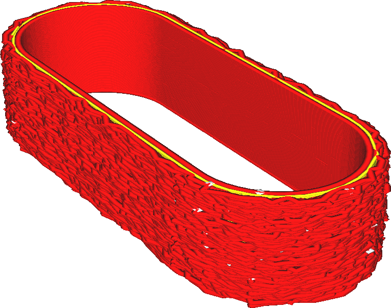

Fuzzy Skin Outside Only
====
If this setting is enabled, the [fuzzy skin effect](magic_fuzzy_skin_enabled.md) will only applied to outside walls of the print.

<!--screenshot {
"image_path": "magic_fuzzy_skin_outside_only.png",
"models": [{"script": "watch_strap_keeper.scad"}],
"camera_position": [-52, -37, 37],
"settings": {
    "magic_fuzzy_skin_enabled": true,
    "magic_fuzzy_skin_outside_only": true
},
"colours": 32
}-->

A fuzzy skin may be a nice effect to give the model some texture or increased grip, but it completely destroys any dimensional accuracy you might expect from the print. This is a problem if the print needs to be mounted on something, such as a handle or a few screws. For such cases, you can disable the fuzzy skin effect on inside contours of the print, confining it to only the outsides.