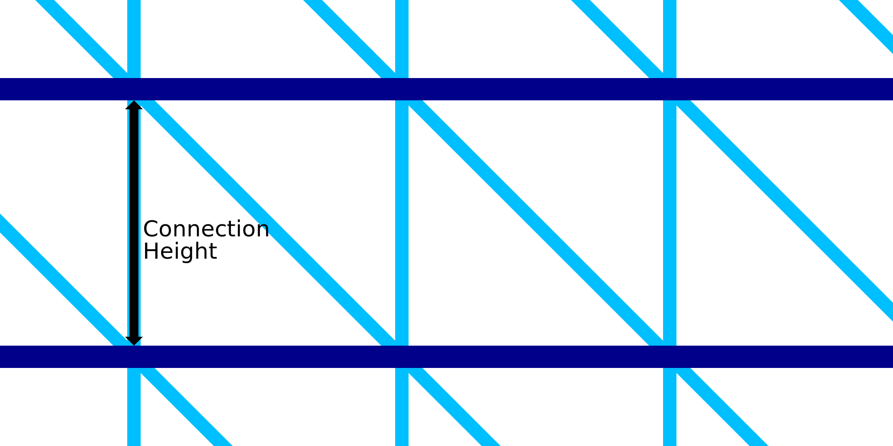

WP Connection Height
====
Wire Printing consists of printing a number of rings around the outline. The vertical spacing of the rings is determined by this setting. With this setting you can define how long the connections between two concentric rings must be.

The rings are connected with a saw-tooth pattern. This consists of a vertical line as well as a diagonal line. The vertical line will be exactly the length of the connection. The diagonal line will be angled at 45°. As a result, this setting not only determines the vertical height between the rings, but also the horizontal size of the saw-tooth pattern. It will determine how dense the frame will become in general.

Reducing the height will make the frame more dense. It will make the frame more stable and will make printing more reliable. However it will also take more time to print then.