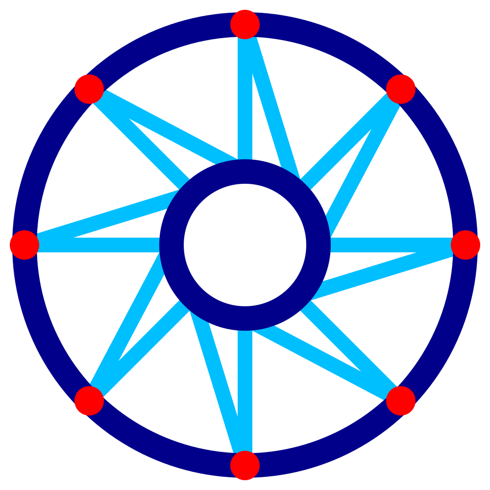

WP Roof Outer Delay
====
With this setting, you can configure the nozzle to stand still for a short moment every time it hits the outer contour while printing the saw-tooth pattern in the roof of the wire frame.

While standing still, the nozzle will produce a tiny blob in the paused location due to oozing. This blob improves the connection between the saw-tooth pattern and the contour around it.

Pausing takes a significant amount of printing time, since there are many locations where the nozzle will pause.