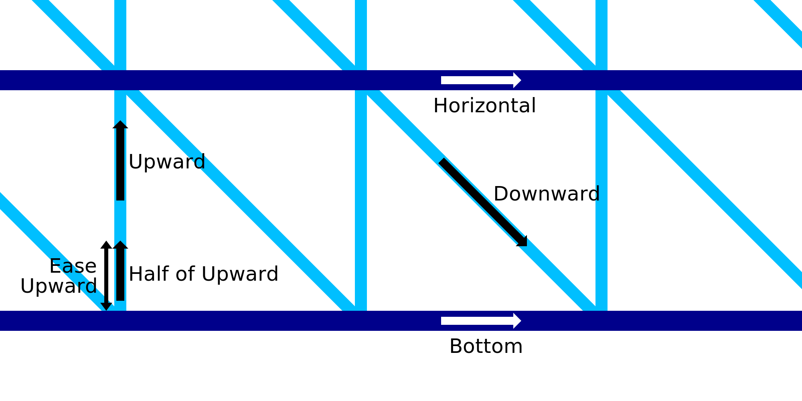

WP Ease Upward
====
When starting with the upwards motion of the saw-tooth pattern connecting adjacent horizontal rings in the frame of Wire Printing mode, the upwards motion may be made slower for the first part of the vertical line. This setting configures how much of the vertical line will be printed slower. This segment of the vertical line will be printed at half of the [upward speed](wireframe_printspeed_up.md).

Instead of [pausing](wireframe_bottom_delay.md) at the bottom, it may be better to keep the nozzle going. This prevents the hot nozzle from re-melting the horizontal ring underneath it, but will still have the effect of pushing the saw-tooth pattern firmly onto the horizontal ring. The pressure inside the nozzle chamber will push the material out down onto the ring underneath.

The speed at which the nozzle moves during this length of wire cannot be separately configured. It will always be half of the normal speed.