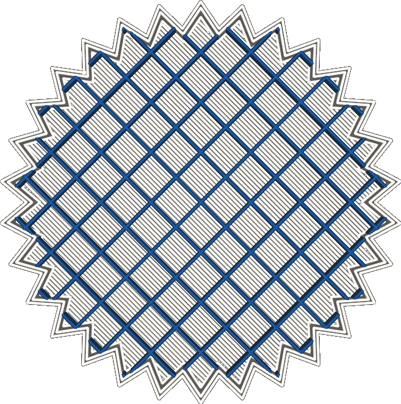

Infill Extruder
====
This setting determines which extruder will be used to print the infill material. It is only available for printers with multiple extruders.

<!--screenshot {
"image_path": "infill_extruder_nr.png",
"models": [
    {
        "script": "gear.scad",
        "object_settings": {"extruder_nr": 3}
    }
],
"camera_position": [0, 0, 180],
"settings": {
    "top_layers": 0,
    "infill_extruder_nr": 1
},
"colour_scheme": "material_colour",
"colours": 32
}-->

If your printer can use a different nozzle for each extruder train, printing infill with a bigger nozzle size will increase printing speed and strength without impeding visual quality of the shell.